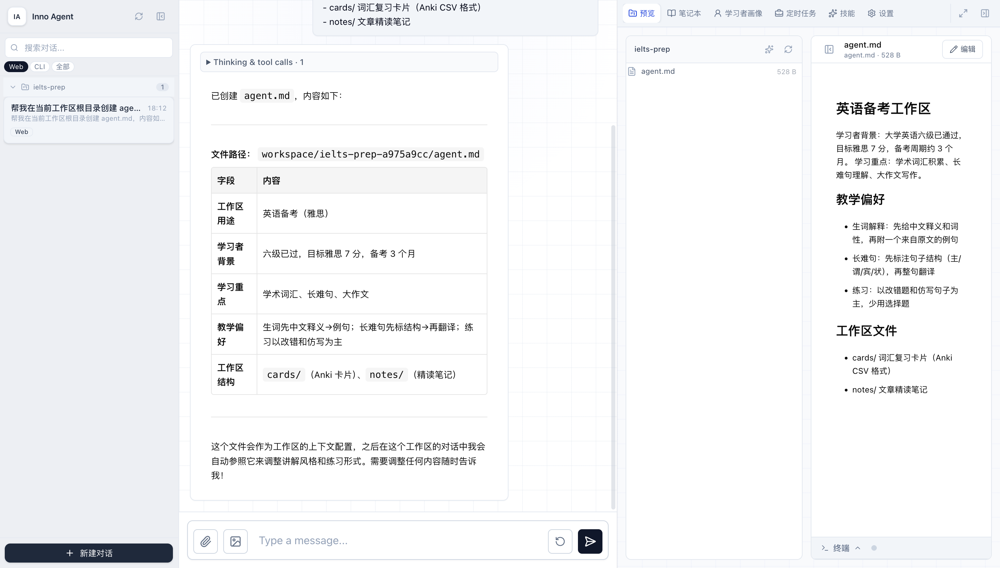
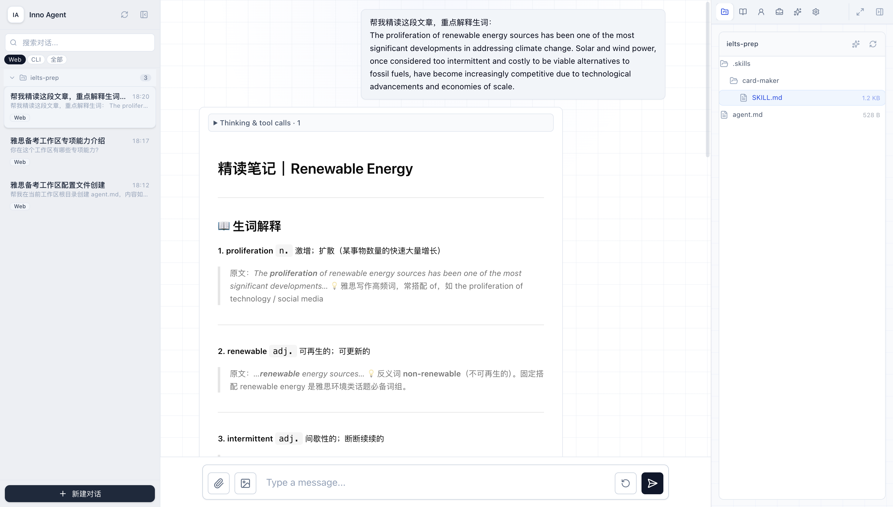
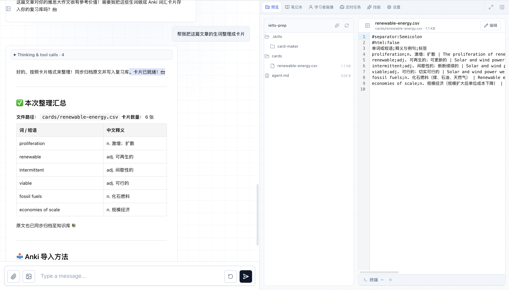

# 用 Inno Agent 搭建专属学习 Agent

**版本** v0.2.3 · 2026-06-07 · 华东师范大学上海智能教育研究院

本文以「英语备考工作区」为例，说明如何用 `agent.md` 定义工作区上下文，用 `.skills/` 添加专项能力，在一个具体工作区里搭建有专属行为的学习 Agent。

---

## 一、设计思路

系统提示词由两个阶段拼装，注入时机不同：

```
━━ 会话创建时固定（Pi SDK）━━━━━━━━━━━━━━━━━━━━━━━━━━━━━━━━━━

  INNO 基础系统提示词
    ↓
  全局 Skills               ← Skills 面板安装，所有工作区共享
    ↓
  当前日期 + 工作目录

━━ 每轮对话动态注入（before_agent_start 钩子）━━━━━━━━━━━━━━━

  L1 上下文包（学习目标 / 掌握度 / 误解 / 偏好）
    ↓
  工作区上下文              ← 跟着工作区走，每轮重新读取
    ├── agent.md            workspace 根目录，直接写，无需上传
    └── .skills/            workspace 工具栏 ✦ 按钮上传的 skill 包
    ↓
  L3 跨对话召回
    ↓
  最近一次代码运行记录
```

**两个文件，两个入口，不能混用：**

| 文件 | 放哪里 | 怎么创建 | 定义什么 |
|---|---|---|---|
| `agent.md` | workspace 根目录 | 让 Agent 创建，或对话中直接写 | 工作区人格：学习背景、偏好、文件说明 |
| `.skills/<名>/SKILL.md` | workspace `.skills/` 子目录 | 工具栏 ✦ 按钮上传 `.md` 或 `.zip` | 专项能力：触发条件、格式规范、操作流程 |

---

## 二、新建工作区

1. 点击左侧会话栏**底部**「**+ 新建会话**」
2. 选择「**新建工作区**」，名称填写 `ielts-prep`
3. 点击「创建」


---

## 三、创建 agent.md

`agent.md` 放在 workspace **根目录**，不经过 skill 上传流程。有两种创建方式：

**方式 A：让 Agent 代为创建（推荐）**

在新会话的输入框里，把模板内容直接粘贴进去发送：

```
帮我在当前工作区根目录创建 agent.md，内容如下：

## 英语备考工作区

学习者背景：大学英语六级已通过，目标雅思 7 分，备考周期约 3 个月。
学习重点：学术词汇积累、长难句理解、大作文写作。

### 教学偏好
- 生词解释：先给中文释义和词性，再附一个来自原文的例句
- 长难句：先标注句子结构（主/谓/宾/状），再整句翻译
- 练习：以改错题和仿写句子为主，少用选择题

### 工作区文件
- cards/   词汇复习卡片（Anki CSV 格式）
- notes/   文章精读笔记
```

Agent 调用文件写入工具，`agent.md` 出现在右侧工作区文件树的根目录。

**方式 B：用文本编辑器手动创建**

用任意文本编辑器（VS Code、记事本等）把上面的模板内容保存为 `agent.md`，然后把文件拖拽到右侧工作区文件树面板的空白区域（确保文件树里没有选中任何子目录，文件会上传到工作区根目录；若选中了 `.skills/` 目录则会被当作 skill 包处理）。



> **注意**：`agent.md` 是普通 Markdown 文件，无需任何 frontmatter。系统注入时会自动加上 `# 工作区上下文 (agent.md)` 标题。

---

## 四、上传词汇卡片 Skill

卡片生成器是一项专项能力，通过 workspace 工具栏的 **✦ 按钮**上传，安装到 `.skills/` 目录。

### 4.1 准备 skill 文件

用文本编辑器新建一个文件，命名为 `card-maker.md`，按自己的需求编写内容。下面是一份可以直接复制使用的示例。唯一的硬性要求是顶部必须有 `---` 包裹的 frontmatter，否则上传后系统会自动生成通用描述，导致 Agent 无法准确识别这项能力：

````markdown
---
name: card-maker
description: 把英语学习材料中的生词整理成 Anki 兼容的词汇卡片
---

## 词汇卡片生成器

### 触发条件

用户说「做成卡片」「整理生词」「生成单词卡」「Anki 卡片」时，进入卡片生成模式。

### 卡片格式

每张卡片格式：`单词或短语;词性 中文释义 | 原文例句;标签`

示例行：

```
ubiquitous;adj. 无处不在的 | Smartphones have become ubiquitous in daily life.;ielts academic
```

规则：
- 例句优先取自用户提供的原文；无原文时自造贴近雅思语境的句子
- 标签固定含 `ielts`，再加内容标签（如 `technology`、`environment`）
- 单次最多 20 张；短语正面写完整短语，不拆开

### 文件操作

写入 `cards/<来源主题>.csv`，文件头固定为：

```
#separator:Semicolon
#html:false
单词或短语;释义与例句;标签
```

生成后告知路径、卡片数，以及 Anki 导入方法（File → Import，分隔符「;」）。

### 记忆联动

- 来源文章调用 `l2_archive` 归档，标题格式 `[雅思阅读] 文章主题`
- 调用 `record_learning_event` 记录 `concept_explained` 事件，`mastery_delta` 设为 0.01
````

### 4.2 上传到 workspace

1. 右侧切换到「**预览**」标签页，打开工作区文件树
2. 点击文件树工具栏右上角的 **✦**（Sparkles）按钮，tooltip 显示「上传技能包 (.zip/.md) 到 .skills」
3. 选择 `card-maker.md`
4. 上传完成后，文件树出现 `.skills/card-maker/SKILL.md`


上传后的目录结构：

```
workspace/
└── ielts-prep/
    ├── agent.md              ← 工作区上下文（步骤三创建）
    └── .skills/
        └── card-maker/
            └── SKILL.md      ← 词汇卡片能力（步骤四上传）
```

### 4.3 验证

**新建一个会话**并绑定 `ielts-prep` 工作区，发送：

```
你在这个工作区有哪些专项能力？
```

Agent 应该同时描述出：工作区的英语备考背景（来自 `agent.md`）和词汇卡片生成能力（来自 `.skills/card-maker/`）。

---

## 五、端到端演示

### 5.1 精读文章片段

发送：

```
帮我精读这段文章，重点解释生词：

The proliferation of renewable energy sources has been one of the most
significant developments in addressing climate change. Solar and wind power,
once considered too intermittent and costly to be viable alternatives to
fossil fuels, have become increasingly competitive due to technological
advancements and economies of scale.
```

Agent 按照 `agent.md` 里的偏好回答——遇到 `proliferation`、`intermittent`、`viable` 等生词，先给中文释义和词性，再引用原句作例句。



### 5.2 生成词汇卡片

精读完后发送：

```
帮我把这篇文章的生词整理成卡片
```

Agent 触发 card-maker 能力，输出类似：

```
已生成 6 张词汇卡片，写入：cards/climate-change.csv

预览：
1. proliferation
   → n. 激增；扩散 | The proliferation of renewable energy sources has been significant.
   标签：ielts environment

2. intermittent
   → adj. 间歇性的 | Solar power was once considered too intermittent to be viable.
   标签：ielts environment
...（共 6 张）

来源已归档：[雅思阅读] Climate Change and Renewable Energy
Anki 导入：File → Import → cards/climate-change.csv，分隔符「;」
```



---

## 六、迭代与维护

| 修改需求 | 操作方式 |
|---|---|
| 调整学习背景、教学偏好 | 直接编辑 `agent.md`，新建会话生效 |
| 修改卡片格式、触发条件 | 在工作区文件树点击 `.skills/card-maker/SKILL.md` → 右侧编辑器修改 → 保存，新建会话生效 |
| 添加新的专项能力 | 准备新的 `<名称>.md`（含 frontmatter），✦ 按钮上传 |
| 禁用某项能力 | 删除 `.skills/<名称>/` 目录 |

两个文件都在每轮 `before_agent_start` 时实时读取，修改后无需重启服务。

---

## 七、全局 Skill：跨工作区通用能力

工作区的 `agent.md` 和 `.skills/` 只对绑定了该工作区的会话生效。如果一项能力需要在**所有工作区都用到**，应该安装为全局 Skill。

### 7.1 适合做成全局 Skill 的场景

| 场景 | 说明 |
|---|---|
| 通用工具 | 网页搜索、文档格式转换、代码执行辅助等 |
| 跨项目学习规范 | 例如「所有工作区都要求 Agent 在讲完概念后主动出一道练习题」 |
| 组织/团队共享规范 | 多人共用一套 Inno 实例时，统一的回答风格或操作规范 |

不适合做全局 Skill 的：项目专属的格式规范、特定工作区的学习背景——这些用 `agent.md` 或工作区 `.skills/` 更合适。

### 7.2 创建与上传

全局 Skill 文件格式与工作区 Skill 完全相同，同样需要 frontmatter：

```markdown
---
name: grammar-checker
description: 检查用户英文写作中的语法错误并给出改正建议
---

## 语法检查器

用户提交英文句子或段落时，逐条列出语法错误，说明错误类型，给出修正后的句子。
```

上传步骤：

1. 点击右侧面板顶部「**技能**」标签页
2. 点击右上角「**上传**」按钮
3. 选择 `.md` 或 `.zip` 文件
4. Skill 出现在列表中，状态为「已启用」


### 7.3 注入时机与工作区 Skill 的区别

| | 全局 Skill | 工作区 `.skills/` |
|---|---|---|
| 安装位置 | `~/.inno-agent/skills/` | `workspace/<名>/.skills/` |
| 上传入口 | 右侧「技能」标签页「上传」按钮 | 工作区文件树 ✦ 按钮 |
| 注入时机 | **会话创建时固定**，之后不变 | 每轮 `before_agent_start` 动态读取 |
| 生效范围 | 所有工作区的所有会话 | 仅绑定该工作区的会话 |
| 修改生效 | 需要重新上传 + **新建会话** | 直接编辑文件 + 新建会话 |

> **注意**：全局 Skill 在会话创建时注入，在会话中途修改或重新上传不会影响已有会话，需要新建会话才能用上新版本。

### 7.4 启用 / 禁用与删除

在「技能」面板的 Skill 列表中：

- **启用/禁用**：点击条目右侧的开关，下次新建会话生效
- **删除**：点击删除图标，从全局 skills 目录移除
- **刷新**：点击工具栏「刷新」按钮，重新加载全部 Skill（已有会话不受影响）

---

## 八、常见问题

**Q：上传 skill 后为什么 description 显示「Project skill uploaded for...」这样的通用描述？**

上传的 `.md` 文件缺少 frontmatter，系统自动生成了描述。在文件顶部加上以下内容再重新上传即可：

```
---
name: 你的-skill-名称
description: 这个 skill 的功能描述
---
```

**Q：不小心把 agent.md 的内容上传成了 skill，怎么清理？**

在工作区文件树里找到 `.skills/agent/` 目录，删除整个目录。然后按第三节的方式让 Agent 在根目录重新创建 `agent.md`。

**Q：修改了 agent.md 或 SKILL.md，但新会话里没有生效？**

确认：
1. 文件保存到了正确路径（`agent.md` 在根目录，`SKILL.md` 在 `.skills/<名>/SKILL.md`）
2. 会话绑定的是 `ielts-prep` 工作区
3. 是**新建的会话**，不是同一个会话继续聊

**Q：agent.md 里可以写多长？**

专注「背景和偏好」，300 字以内。具体操作规范（格式、触发条件）交给 `.skills/`，`agent.md` 只留那些每次对话都需要让 Agent 知道的信息。

**Q：✦ 按钮只接受 .md 吗？**

接受 `.md` 和 `.zip`。`.zip` 里要有一个 `SKILL.md` 文件，适合把 skill 和它依赖的辅助文件打包在一起。

---

*Inno Agent v0.2.3 · 华东师范大学上海智能教育研究院*
