# 欢迎使用 Inno 教学助手 🎒

*适用版本 v0.4.1*

这是一份面向老师的图文上手指南。你**不需要任何技术背景**——打开网页,用大白话说清楚"几年级、什么学科、哪节课",它就帮你把**教案、题目、知识讲解、课件、课堂互动网页**做出来,并存成可直接用的文件。

Inno 有**两种用法**,这份文档按它们分成两章:

- **第一章 · 简单模式**——开箱即用。选一张助手卡片,直接出成品,适合日常备课。
- **第二章 · 普通模式**——完整功能。管理多个项目、给 AI 配长期记忆、记笔记、设定时任务、配置模型与飞书,适合深度使用与管理配置。

两种模式**随时切换、数据互通**,你可以先用简单模式上手,需要时再进普通模式。

> 💬 **读不下去也没关系——直接问它就行。** 这份文档里的任何操作、配置,你都可以**直接在对话框里用大白话跟助手说**,让它带你做。比如不知道怎么接飞书,就发一句:
>
> ```
> 我想把助手接到飞书,该怎么配?一步步教我
> ```
>
> 它会一步步告诉你点哪里、填什么。换句话说,**这份说明书本身,也可以"问"出来。**

> 😇 用的过程中有任何不顺手,欢迎反馈,我们会持续完善这份文档～

---

## 🤔 它能帮我做什么?

把它想成一位**随叫随到的备课搭子**:你说一节课,它出成品。

- 要上课 → 帮你写**教案**
- 要练习 → 帮你出一套**分层练习题**(还自动配答案解析)
- 要讲清楚 → 帮你把知识点**讲得通俗**,分基础/重点/难点/易错点
- 要上大屏 → 帮你做一个**课堂互动网页**(随堂答题、动画演示)
- 要课件 → 帮你生成可编辑的 **PPT**

而且产出都会**存成文件**,随时回看、下载、继续改。

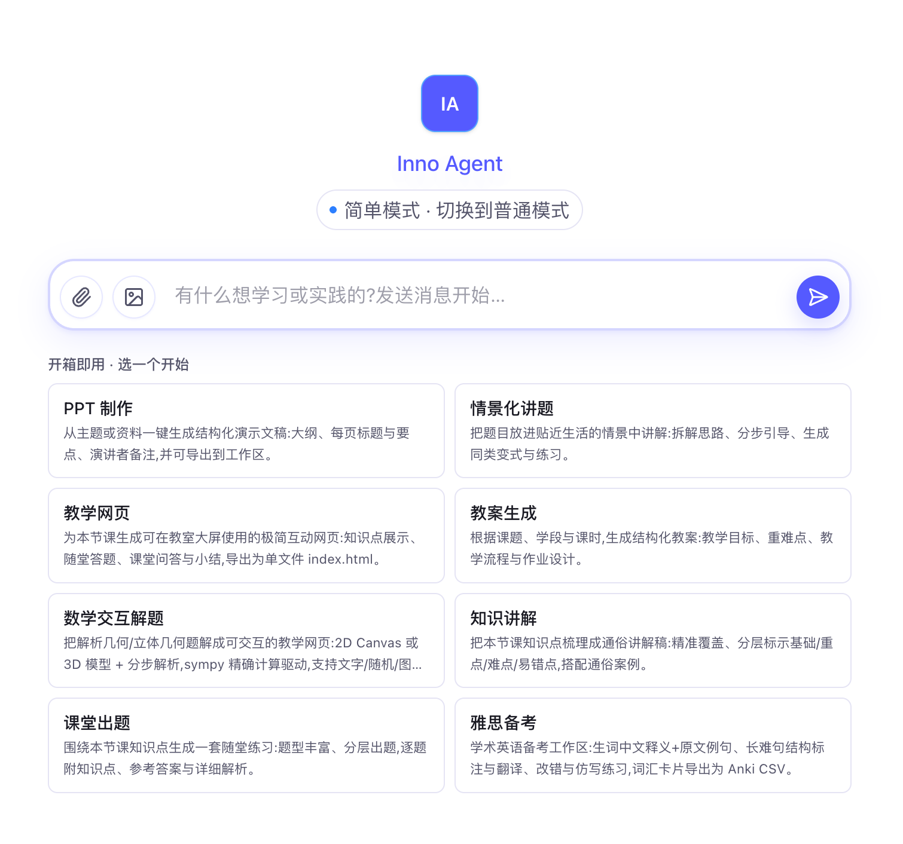

---

## 🚀 打开就能用

1. 用浏览器打开在线地址：`http://www.innoagent.tech/`
2. 模型通常已经配好,**打开即用**。(若需自己接入或更换模型,见后文「配置环节 · ⚙️ 配置模型」。)
3. 看到聊天界面,就成功了 🎉

> 建议用 Chrome / Edge 等现代浏览器,体验最佳。

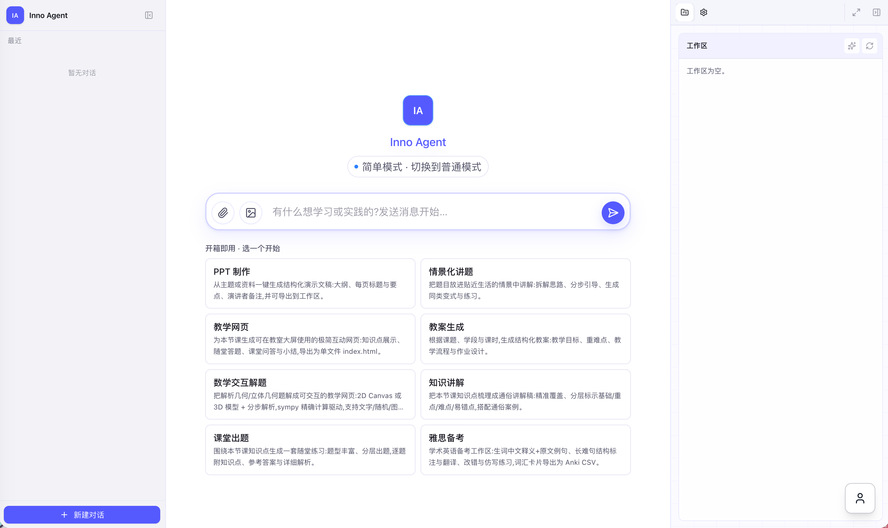

**两种模式怎么切换?** 界面里有一个**模式开关**(在左侧栏的模式按钮,或设置页的「简单模式」开关)。开启简单模式 = 第一章的精简体验;关闭 = 第二章的完整体验。点一下就切,随时来回。

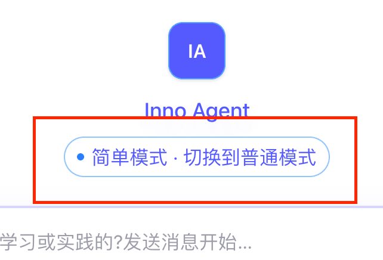

<div class="chapter first"><b>第一章 · 简单模式</b><span>选一张卡片，直接出成品——日常备课最快的路</span></div>

## 🧭 进入「简单模式」,选一个助手

- 进页面后,如果**没看到一排教学卡片**,点输入框附近的**简单模式开关**切过去(再点一下可切回普通模式)。
- 简单模式的欢迎页会出现一排卡片:**「开箱即用 · 选一个开始」**。
- **点哪张卡,就进入哪个助手**;之后像聊天一样把需求说清楚即可。
- 它做出来的东西都会**自动存成文件**,放在这个助手的专属空间里,随时能看、能下载。

💡 **不想选助手?直接问也行**——简单模式下,**不点任何卡片**,直接在底部输入框里发消息,就进入通用问答。备课思路、解释知识点、帮你改一段话都行;**需不需要把结果存成文件,看你怎么说**——只想聊聊就纯聊,让它"做一份""导出来",它也会照办。

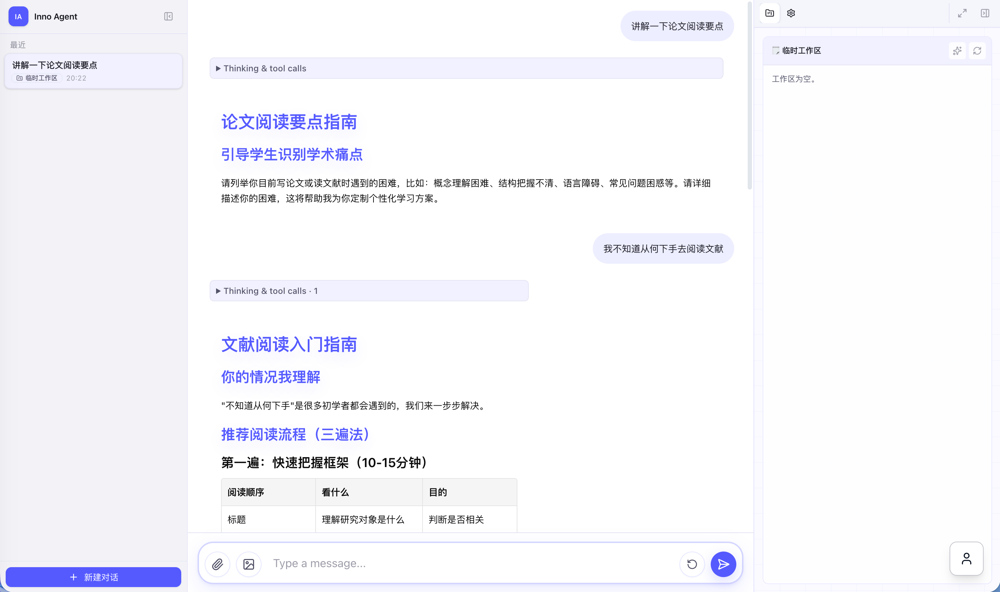

💡 **用着用着想换个助手?**——点左侧栏**下方的「新建对话」**,就回到欢迎页重新选卡片。左侧栏里也能看到各助手的历史对话,随时点回去接着用;各助手的文件和记录互不干扰。

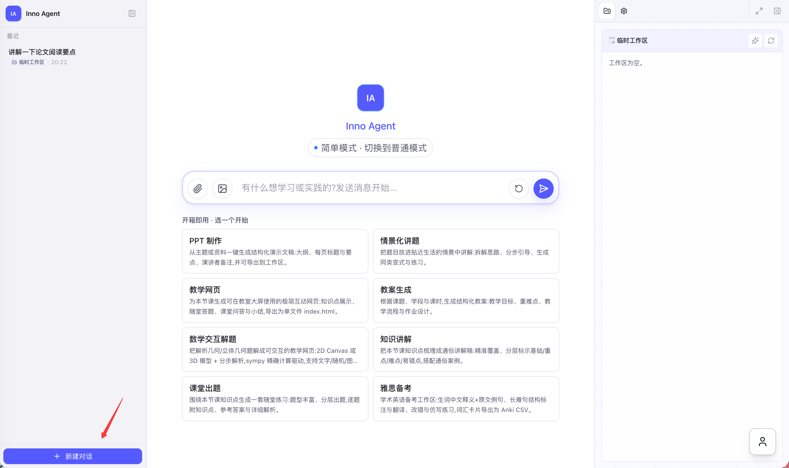

---

💡 **一句话用好它**——选了助手后,开口时一次把 **年级 / 学科 / 课题** 说全。把下面这句复制进输入框试试:

```
高一 数学《函数的单调性》,帮我做一份教案
```

👉 复制这句话到输入框,然后回车

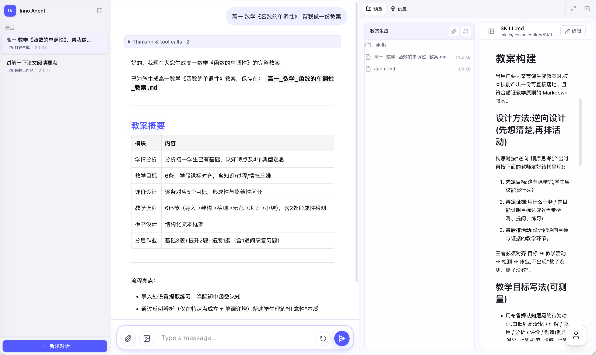

---

## 🧰 七个教学助手怎么用

| 卡片 | 帮你做什么 | 你要告诉它 | 你会得到 |
|---|---|---|---|
| 📘 **教案生成** | 一节课的完整教案 | 年级、学科、课题(可加课时,默认 40 分钟) | 结构化教案:教学目标、重难点、教学流程、分层作业、教学反思 |
| 📝 **课堂出题** | 一套随堂练习 | 年级、学科、本节课知识点 | 学生卷(纯题)+ 教师卷(含答案与详细解析),分基础 / 提升 / 拓展三层 |
| 📖 **知识讲解** | 把知识点讲通俗 | 年级、学科、课题 | 可照着讲的讲解稿:分基础 / 重点 / 难点 / 易错点,配通俗案例;可顺带出课件 |
| 🖥️ **教学网页** | 教室大屏用的互动网页 | 年级、学科、课题、本节内容 | 一个网页文件,双击就能开、投大屏。**会先让你勾选要哪些模块**(见下) |
| 📐 **数学交互解题** | 把几何题做成可交互网页 | 一道解析几何 / 立体几何题(打字、传照片、或让它随机出) | 交互解题网页:2D 画板或可旋转 3D 模型 + 分步讲解,能单步 / 暂停 / 重放 |
| 📊 **PPT 制作** | 一套可编辑的 PPT | 主题、讲给谁、大概几页、风格 | 含大纲的可编辑 PPT 文件(自带配色排版) |
| 💡 **情景化讲题** | 把题目放进生活情景里讲 | 题目、年级、学科、知识点 | 情景化讲解 + 同类变式题 |

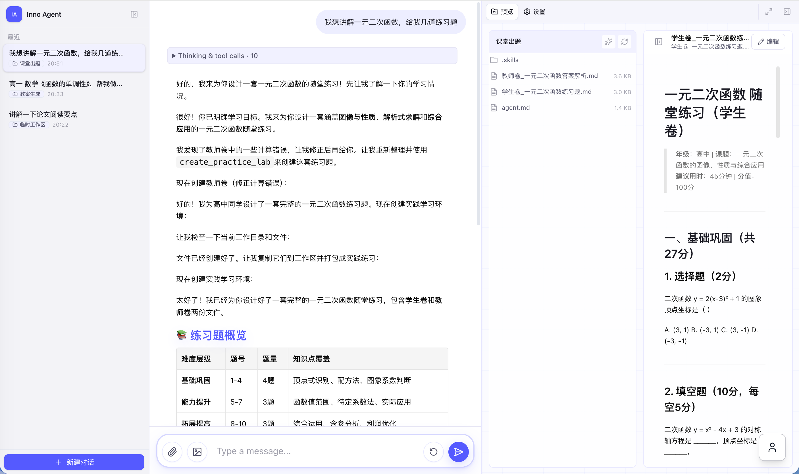

### 几个好用的细节

**🖥️ 教学网页**——专为教室大屏优化(字大、对比强、断网也能开)。开工前它会用一个**多选清单**问你这节课的网页要哪些模块,按需勾选、不必全做:

- 课程知识点展示
- 可交互动态演示(动画:拖参数看变化、分步演示、高亮重点)
- 随堂互动答题(点击即时判对错)
- 课程小结
- 实时课堂问答(点名 / 抢答 / 计时)

动画和演示都能让老师或学生**自己控制节奏**(单步、暂停、重放)。

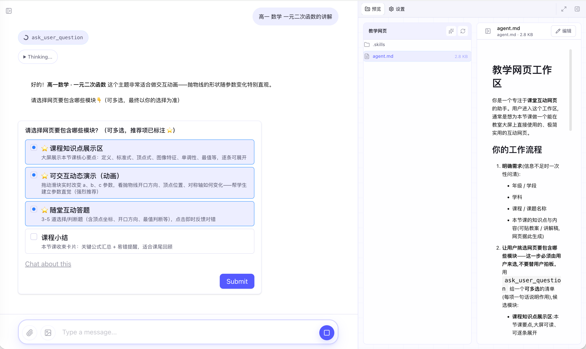

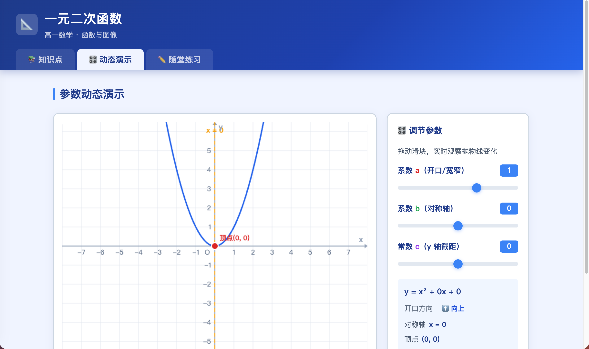

**📐 数学交互解题**——三种给题方式:直接打字、上传题目照片(它识别后会先念给你确认)、或让它随机出一道。

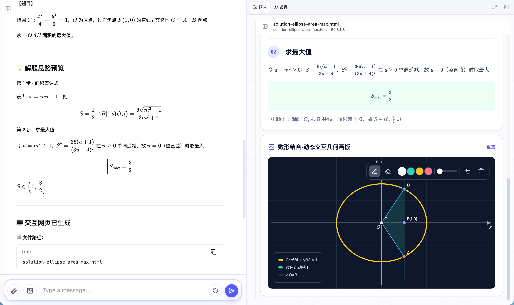

**📊 PPT 制作 / 知识讲解出课件**——会附上一份大纲,方便你把握整体结构。

---

## 📂 做好的东西在哪、怎么拿

- 每个助手生成的文件,都放在它**自己的空间**里,界面上能浏览、下载。
- **教案、讲解稿、题目**是 `.md` 文档（Markdown 格式),用记事本 / Word / 任意文本编辑器都能打开,也可直接把内容复制走。
- **教学网页**是一个 `.html` 网页文件,下载后双击用浏览器打开,再投到教室大屏。
- **PPT** 是可编辑的 `.pptx` 演示文稿。
- 同一个助手反复用,会用同一个空间,历次成果归档在一起,方便回头查。

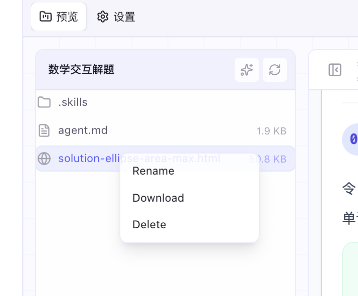

**教学网页怎么打开和放大?**
下载 `.html` 文件后:① 在文件管理器里双击,系统会用浏览器打开;② 投影时可按 `Ctrl +`(Windows)或 `⌘ +`(Mac)整体放大页面,适配不同屏幕距离。

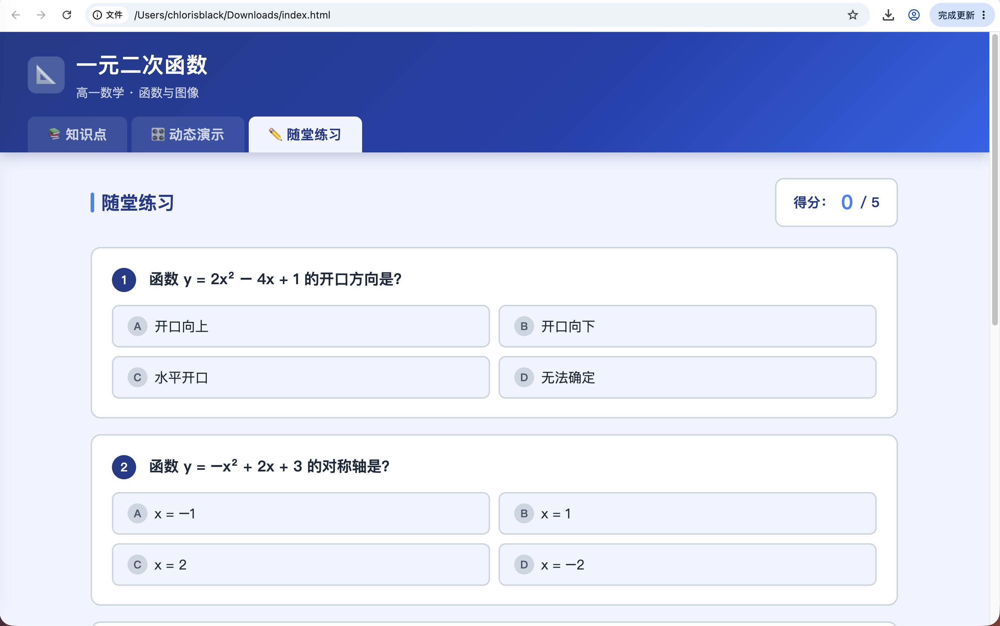

<div class="chapter cfg"><b>配置环节 · 选做</b><span>接入自己的模型、把助手装进飞书——通常由管理员配置一次,日常使用的老师可跳过</span></div>

> 下面两件事都在**普通模式的「设置」页**里完成(简单模式下设置被简化、看不到这些项)。**全程在网页里点选,不用改任何文件。** 在线版通常已配好模型,可直接跳到第二章。

## ⚙️ 配置模型

打开**设置 → 模型 / 服务提供方**,新增一个模型来源:

1. **提供方 ID(Provider)**:起个标识,如 `anthropic`、`deepseek`。
2. **接口地址(Base URL)**:服务商给的 API 地址,如 Anthropic 官方 `https://api.anthropic.com`、DeepSeek `https://api.deepseek.com`。
3. **接口类型(API)**:
   - Anthropic / Claude 官方 → 选 `anthropic-messages`
   - OpenAI、DeepSeek、通义等"OpenAI 兼容"服务 → 选 `openai-completions`
4. **API Key**:把申请到的密钥粘进来(当密码保管,别外泄)。
5. **模型 ID**:服务商规定的模型名,如 `claude-sonnet-4-6`、`deepseek-chat`。
6. **模型名称**:给自己看的名字,随意。

填好**保存**,再到**界面顶部的模型选择器**里选为当前模型(选择会被记住)。

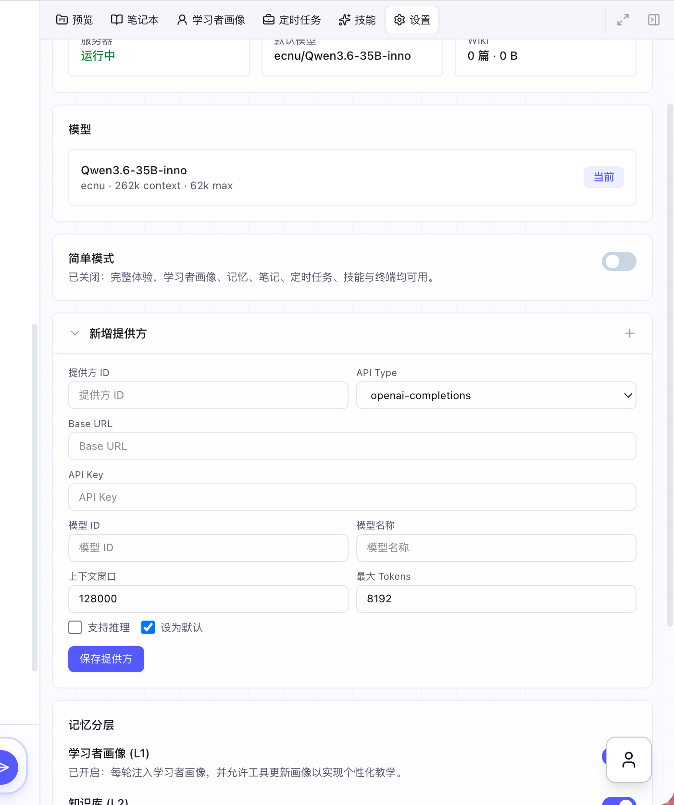

> 😅 **发消息后一直转圈、没回复?** 九成是 API Key 或接口类型填错了:Anthropic / Claude 官方选 `anthropic-messages`,OpenAI / DeepSeek 选 `openai-completions`,填错会静默失败。

---

## 📱 接入飞书

把助手接到飞书,**用手机就能随时对话**,相当于把教学助手装进飞书。

> ✅ 本系统用飞书的**长连接(WebSocket)**方式收发消息——**不需要公网服务器,也不用填回调地址**,只要 App ID 和 App Secret。

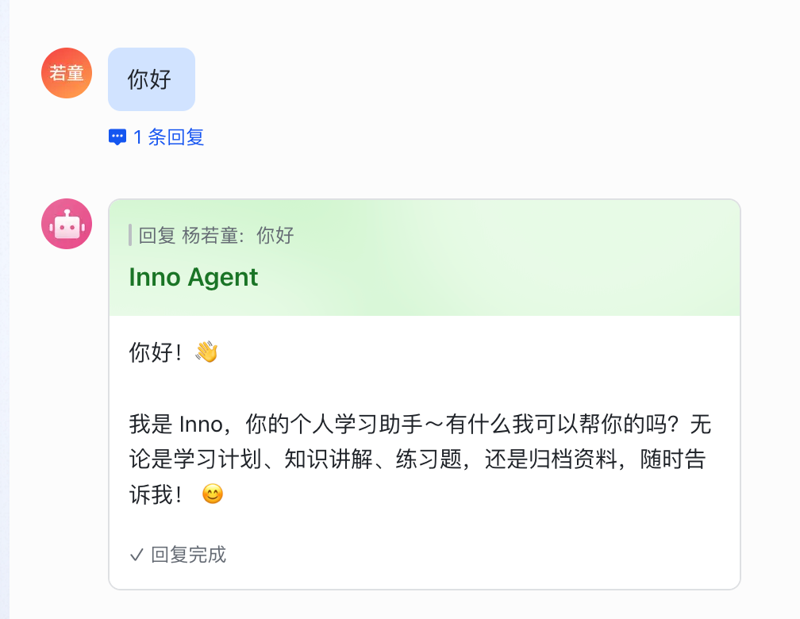

**第一步:在飞书开放平台建应用**

1. 打开飞书开放平台(open.feishu.cn)→ 开发者后台 → **创建企业自建应用**。
2. 进应用 →「凭证与基础信息」,记下 **App ID** 和 **App Secret**。
3. 在「应用能力」里**启用「机器人」**。
4. 「权限管理」开通**消息相关权限**:接收用户发给机器人的消息、发送消息(以及上传图片 / 文件以便回传)。
5. 「事件订阅」选**长连接(使用 SDK / WebSocket)方式**(不要选填 URL 的那种),添加事件 **「接收消息 im.message.receive_v1」**。
6. 按平台提示**创建版本并发布**,让权限生效。

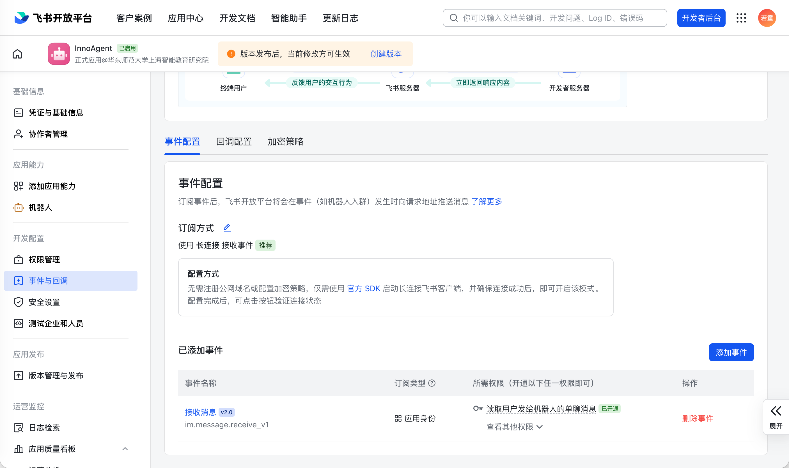

**第二步:在 Inno 网页里填上**

1. 打开**设置 → 消息渠道 → 飞书**。
2. 填 **App ID**、**App Secret**,打开**飞书开关**。
3. (可选)**仅私聊**:默认开,只回应一对一私聊;**允许的用户**:留空 = 不限,或填用户 ID 白名单(每行一个)。
4. **保存**;重启服务后,飞书会自动建立长连接。

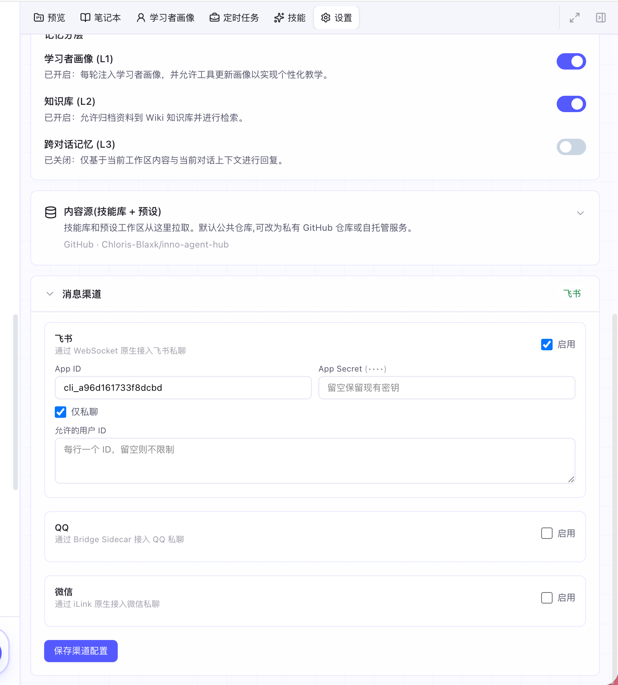

**第三步:开用**——在飞书里搜到并**私聊这个机器人**,直接发消息,就和在网页里一样对话。

<div class="chapter"><b>第二章 · 普通模式</b><span>完整的工作台——记忆、画像、笔记、定时任务与全部设置</span></div>

简单模式像"点菜"——选一个助手就开吃;普通模式像"自己进厨房"——所有功能和设置都摆在面前。它适合想**深度使用**(给 AI 配长期记忆、建知识库、设定时任务)或要做**管理配置**(接模型、接飞书)的老师。

**怎么进?** 把界面里的**简单模式开关关掉**(左侧栏模式按钮会显示"当前:普通模式"),欢迎页的助手卡片就会换成完整的工作台界面。

> 💡 别被"完整"吓到——核心还是中间那个对话框,右侧那些标签页**按需点开**即可,不用全用。

---

## 🖥️ 界面长什么样(三栏)

普通模式是经典的三栏布局:

- **左侧栏**——你的**工作区**和**历史对话**,在这里新建、切换、搜索、归档。
- **中间**——**对话区**,和 AI 聊天的地方,可发文字、传文件、传图片。
- **右侧面板**——**多个标签页**:预览文件、笔记本、学习者画像、定时任务、技能、设置。

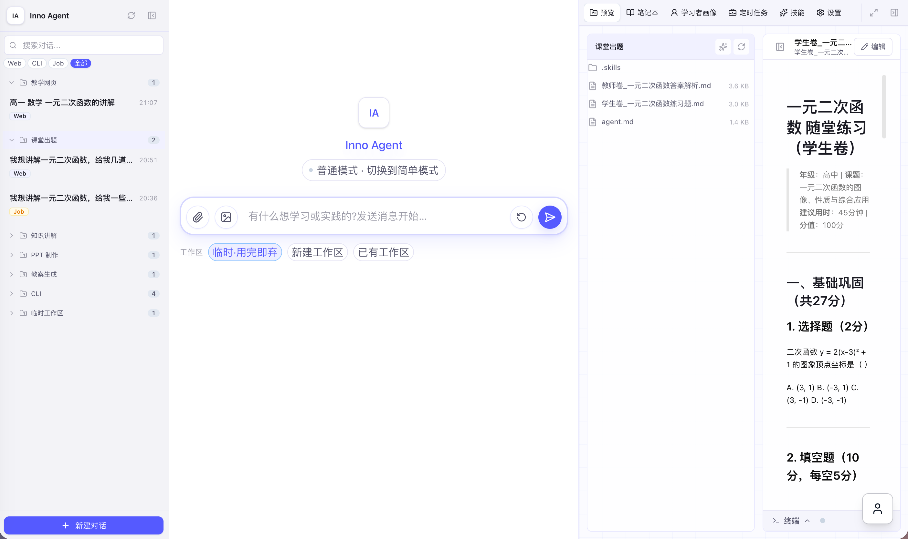

---

## 🗂️ 左侧栏:工作区与对话

**工作区(Workspace)** 就像一个"项目文件夹",里面装着围绕同一主题的多次对话和它们产出的文件。左侧栏的工作区从上到下分成几组:

- **你的项目**——你自己新建的工作区,可重命名、可删除。
- **渠道工作区**——从飞书 / 微信 / 命令行 过来的对话,系统**自动建立、自动归类**(不能改名或删除)。
- **临时**——随手聊的临时空间,同样由系统自动管理。
- **已归档**——你**归档过的对话**会收到这里,固定在最底部、默认折叠,随时可恢复(注意:归档的是单条对话,不是整个工作区)。

常用操作:

- **新建对话 / 新建**(`+` 按钮)——在选中的工作区里开一段新对话。
- **重命名 / 删除**——把鼠标移到**你自己建的工作区**上,会出现对应小图标(渠道 / 临时工作区由系统托管,没有这些操作)。
- **归档对话**——把鼠标移到**单条对话**上,点归档图标即可收起;在"已归档"组里可恢复。
- **搜索框**——按名字快速找历史对话。
- **渠道筛选**——只看来自某个渠道的对话,渠道有 **Web / 飞书 / 微信 / CLI / Job** 五种。

每条对话会显示名称、时间,以及**来源渠道**的小标记。这里的 **Job** 指**定时任务自动触发**产生的对话(见后面「定时任务」),它只是一种来源标记,既不是工作区分组、也不等于"已归档"。

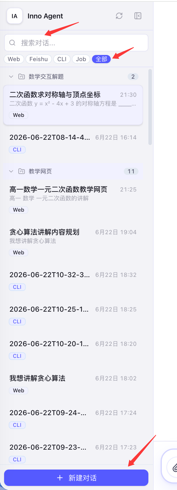

---

## 💬 对话区:不止于打字

中间的输入框除了打字,还能传东西给 AI:

- **文字**——`Enter` 发送,`Shift + Enter` 换行。
- **📎 传文件**——点回形针图标上传资料(教材、PDF、表格等),AI 会据此回答,并可归档进知识库。
- **🖱️ 拖拽上传**——也可以把电脑里的文件**直接拖到右侧「预览」面板**松手,即上传到当前工作区(拖拽的落点是右侧文件面板,不是输入框)。
- **🖼️ 传图片**——点图片图标选图,或直接 `Ctrl / ⌘ + V` **粘贴截图**;可以发题目照片、板书、图表让它识别。
- **停止 / 重试**——生成过程中可随时点「停止」;万一某条失败,会出现「重试」。

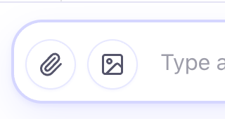

---

## 🧩 右侧面板:六个标签页

| 标签 | 作用 |
|---|---|
| 📁 **预览** | 浏览 / 编辑当前工作区的文件(教案、网页、PPT 都在这)。支持 Markdown、表格、图片、PDF 预览,文本可直接改;也可把电脑里的文件**拖进来上传**。 |
| 📓 **笔记本** | **L2 知识库**:把资料沉淀成一张可检索的"知识图谱",可按 资料 / 实体 / 概念 / 分析 筛选。 |
| 👤 **学习者画像** | **L1**:记录**使用者本人**(可以是学生,也可以是老师)的学习目标、知识掌握、易错点、学习偏好,让 AI 越用越懂你。 |
| ⏰ **定时任务** | 让 AI 按计划自动干活:每日复盘、每周总结、间隔复习提醒等。 |
| ✨ **技能** | 技能库:查看已加载技能、从技能库导入新技能、上传自己的技能包。 |
| ⚙️ **设置** | 模型、记忆、渠道、主题语言等全部配置(下面详述)。 |

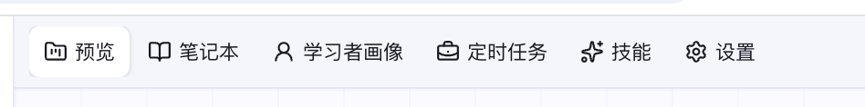

---

## 🧠 让 AI 拥有记忆:L1 / L2 / L3

普通模式和简单模式最大的不同,是 AI 能**记住东西**。三层记忆可在 **设置 → 记忆** 里分别开关:

- **L1 · 学习者画像**——记住"**使用你的人是谁**"(不限学生还是老师):学习目标、哪些概念掌握了、常犯什么错、喜欢什么讲法 / 学法。开启后每轮对话自动带上,实现**因人而异的个性化**。
- **L2 · 知识库(笔记本)**——把对话里的资料归档成可检索的知识库,下次能随时调取。
- **L3 · 跨对话记忆**——跨越不同对话**自动回忆**相关内容,不用每次从头交代背景。

> 简单模式下这三层是统一关闭的——所以那里看不到笔记本、画像这些标签页。想用记忆功能,就在普通模式里开。

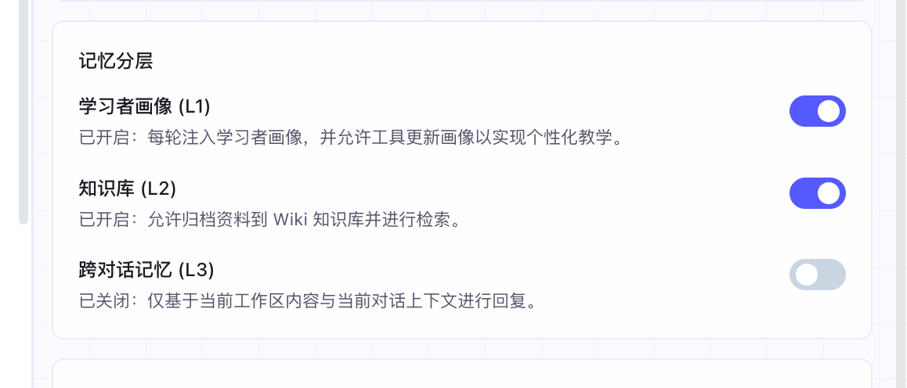

---

## ⏰ 定时任务

让助手按计划自动跑,适合"周期性的事"交给它:

- **任务类型**——内置每日复盘 / 每周总结 / 图谱更新 / 画像反思 / 间隔复习 / 推送提醒等几种;也可以选「自定义提示」,**用一段话让它定时做你描述的任何事**。
- **频率**——每天 / 每周 / 每月 / 工作日 / 仅一次 等都能点选,还能用**自定义 Cron** 精确到你想要的任意时间。
- 每个任务可启用 / 停用、立即运行、编辑、删除,并显示上次 / 下次运行时间。

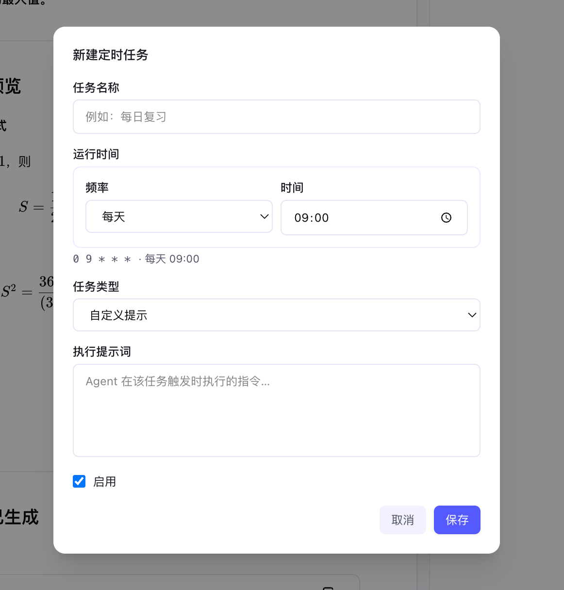

---

## ✨ 技能

技能 = 给 AI 的"专项能力包"。第一章那七个教学助手,背后正是预先配好的技能。在**技能**标签页里你可以:

- **查看**已加载的技能及其内容。
- **从技能库导入**——一键加载内容源里提供的更多技能。
- **上传**自己的 `.zip` 技能包。

> 📎 **想自己写一个技能?** 本文后面附了一篇实操案例《用 Inno Agent 搭建专属学习 Agent》,以"英语备考工作区"为例,手把手讲怎么用 `agent.md` 定义工作区行为、用 `.skills/` 添加专项能力,搭出有专属行为的学习 Agent。

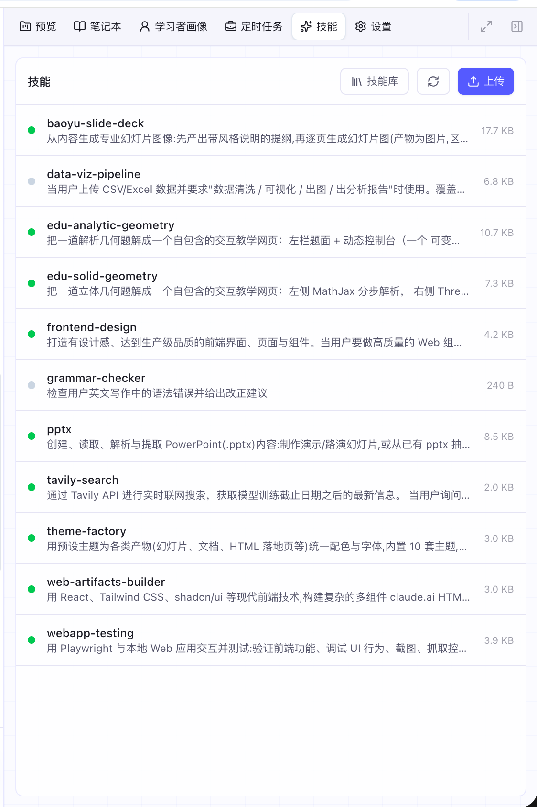

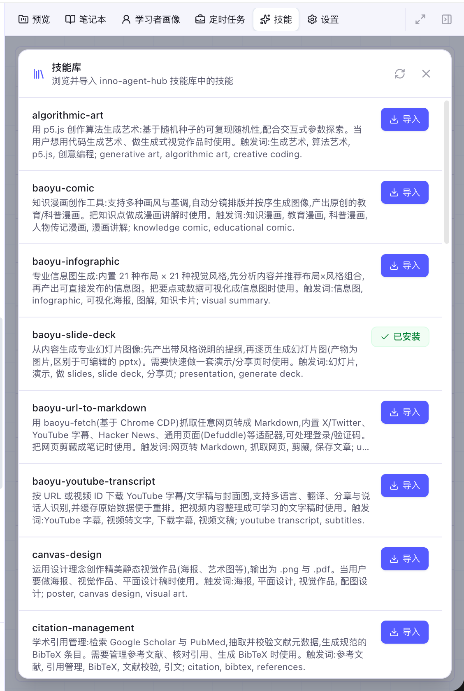

---

## 🎨 其它设置:主题、语言、内容源

- **主题与语言**——设置顶部可切换界面**主题**(浅色 / 暖色 / 海洋 / 启创)和**语言**(中文 / English)。
- **内容源(进阶)**——决定"技能库和预设助手"从哪里拉取。默认是公共仓库,开箱即用、一般不用动;学校自部署时可改为私有 GitHub 仓库或自托管服务。

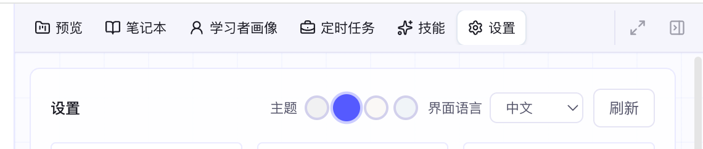

---

## 🙋 常见问题

**Q:简单模式和普通模式,我该用哪个?**

日常备课、要现成成品 → **简单模式**;想管理多个项目、给 AI 配记忆 / 画像、记笔记、设定时任务、改模型或接飞书 → **普通模式**。两者随时切换,数据互通。

---

**Q:普通模式会不会太复杂?**

不用全用。核心还是中间的对话框,右侧那些标签页**按需点开**即可。先当成"能记笔记、有记忆的简单模式"用就行。

---

**Q:没看到那排教学卡片?**

先确认在「简单模式」(切换开关在输入框附近 / 左侧栏);普通模式不显示这些卡片。若已经在简单模式却还看不到卡片(比如正停在某段历史对话里),**点一下左侧栏底部的「新建对话」**,就会回到带卡片的欢迎页。

---

**Q:它问得太细 / 答不到点上?**

开头一次把"年级 / 学科 / 课题 / 这节课要讲什么"说清楚,给得越具体、产出越贴合。

---

**Q:想改它做出来的东西?**

直接在对话里说,比如"把第 3 题换成填空""教案的导入再生动点",它会改并重新存档。

---

**Q:想换个助手?**

点左侧栏**底部的「新建对话」**,就回到简单模式欢迎页重新选卡片;各助手的文件和历史互不干扰。

---

*Inno 教学助手 · 适用 v0.4.1 · 开源 MIT · 华东师范大学上海智能教育研究院*
