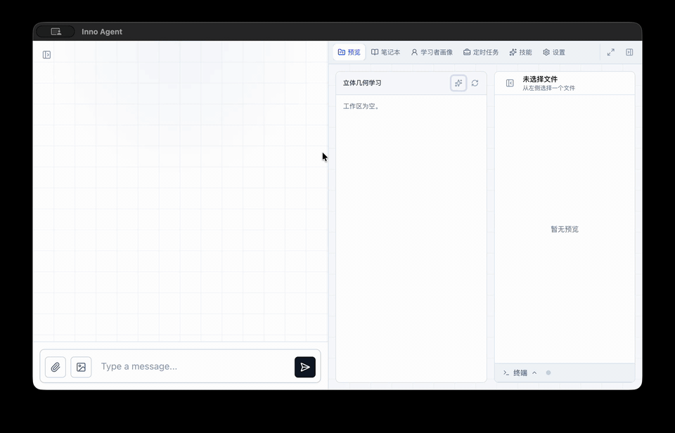
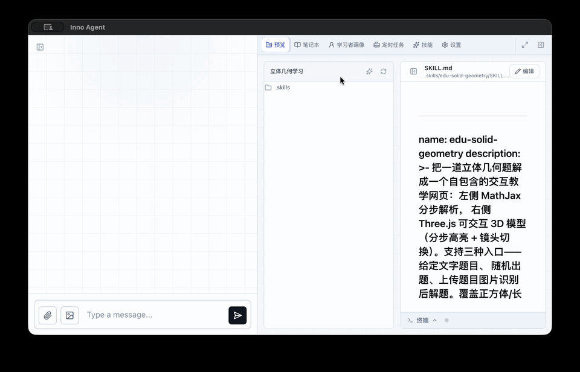

# Skill Library

Inno Agent Skill 集合整理 —— 每个 Skill 是独立目录，可直接下载打包上传到工作区。


## Skill 列表

按场景分组，便于按需取用。

### 📐 教育 · 数学

| Skill | 类型 | 一句话 | 引用 | 效果 |
|---|---|---|---|---|
| [edu-solid-geometry](./edu-solid-geometry/) | 收集 | 立体几何题 → Three.js 交互 3D 解题页 | [wy51ai/edulab](https://github.com/wy51ai/edulab/tree/master/skills/edu-solid-geometry) | [demo](./assets/edu-solid-geometry/demo.gif) |
| [edu-analytic-geometry](./edu-analytic-geometry/) | 收集 | 圆锥曲线题 → Canvas 2D 动态画板 | [wy51ai/edulab](https://github.com/wy51ai/edulab/tree/master/skills/edu-analytic-geometry) | [demo](./assets/edu-analytic-geometry/demo.gif) |


---

## 快速使用

从本仓库下载 Skill 目录（或自行打包为 `.zip`），按需求选择**全局**或**工作区**上传入口：

<table>
  <tr>
    <td width="50%" valign="top">
      <h3>工作区 Skill（局部）</h3>
      <p>仅对绑定该工作区的会话生效。在工作区「预览」页，点击文件树工具栏 <strong>✦</strong> 按钮，上传 <code>.md</code> 或 <code>.zip</code>。</p>
      <p>落盘：<code>workspace/&lt;名&gt;/.skills/&lt;skill-name&gt;/SKILL.md</code></p>
      
    </td>
    <td width="50%" valign="top">
      <h3>全局 Skill</h3>
      <p>对所有工作区的会话生效。点击右侧「<strong>技能</strong>」标签页 → 右上角「<strong>上传</strong>」。</p>
      <p>落盘：<code>~/.inno-agent/skills/&lt;skill-name&gt;/SKILL.md</code></p>
      
    </td>
  </tr>
</table>


---

## 目录结构

```
skill-library/
├── README.md
├── assets/                          # 文档展示用，不参与上传
│   ├── upload-workspace-skill.gif   # 工作区上传示意
│   ├── upload-global-skill.gif      # 全局上传示意
│   ├── edu-solid-geometry/demo.gif
│   └── edu-analytic-geometry/demo.gif
├── edu-solid-geometry/              # ← 可直接打包上传
│   ├── SKILL.md
│   ├── lib/  scripts/  template/  references/
│   └── README.md                    # 该 Skill 的安装与使用说明
└── edu-analytic-geometry/
    └── ...
```

---

## 贡献新 Skill

提交 PR 时请按以下结构组织，便于他人复用：

1. **新建目录** `skill-library/<your-skill>/`，至少包含：
   - `SKILL.md` — 技能正文（必需，Inno Agent 实际读取的文件）
   - `README.md` — 介绍、依赖、安装步骤、效果说明
   - 视需要：`lib/` `scripts/` `template/` `references/`
2. **效果图** 放到 `skill-library/assets/<your-skill>/demo.gif`（或 `.png`），避免视频文件
3. **回到本 README**，在对应分类表格里追加一行；若是新分类，复用上方注释里的模板小节标题
4. **类型标注**：`收集`（来自上游） / `整理`（基于上游改造） / `自研`

> Skill 包写作规范参见 [`../how-to/skill-tutorial.md`](../how-to/skill-tutorial.md)。
