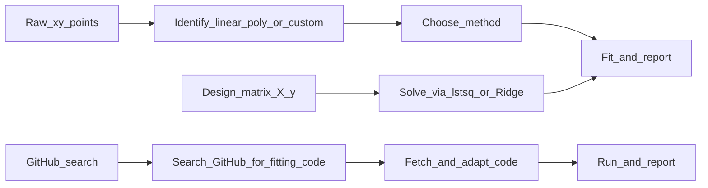

<!--
  作者：李爽夕
  数据来源：部分 benchmark 示例数据来自 NIST Statistical Reference Datasets (StRD)
  https://itl.nist.gov/div898/strd/nls/nls_main.shtml
  NIST 数据为美国政府公共领域产品，可自由使用，需注明来源。
-->

# 最小二乘拟合：数据建模与参数估计

## 适用场景

- **线性回归**：建立变量间的线性关系，如 `y = a + bx` 拟合销售趋势
- **多项式拟合**：拟合非线性但光滑的关系，如 `y = a + bx + cx^2` 拟合生长曲线
- **自定义模型拟合**：使用已知函数形式拟合，如指数衰减 `y = a*exp(-bx) + c`
- **加权拟合**：处理不同精度的数据点，如方差已知的测量数据
- **正则化回归**：防止过拟合，处理多重共线性，如 Ridge/Lasso 回归
- **带约束拟合**：参数有物理上下限或等式约束，如浓度必须为正
- **贝叶斯拟合**：需要参数后验分布，如 MCMC 采样

**输入**：可以是 **(x, y) 数据点**，也可以是 **已构建设计矩阵的 X, y**。

## Quick Start（先做这个）

按下面清单执行并在回答中保留结构。**环境准备必须先于拟合**。

- [ ] **环境准备与依赖安装（必须第一步）**：
  1. 检测 Python 环境中已安装的科学计算包：`pip list | findstr -i "numpy scipy scikit-learn statsmodels lmfit matplotlib cvxpy iminuit nlopt jax emcee"` 或 `pip list | grep -iE "numpy|scipy|scikit-learn|statsmodels|lmfit|matplotlib|cvxpy|iminuit|nlopt|jax|emcee"`
  2. 按需列出可用/缺失包，**询问用户**是否安装缺失的包
  3. 用户确认后执行安装：`pip install numpy scipy scikit-learn matplotlib`
  4. 安装完成后验证导入：
     ```python
     import numpy; import scipy; import sklearn
     print(f"numpy={numpy.__version__}, scipy={scipy.__version__}, sklearn={sklearn.__version__}")
     ```
  5. 若全部不可用且安装失败 → 走 GitHub 搜索路径
- [ ] 路径判断：用户给的是数据点/设计矩阵，还是要求从 GitHub 找代码
- [ ] 数据准备：确保 x, y 为等长 numpy 数组，无 NaN/Inf
- [ ] 问题识别：判断是线性、多项式、自定义函数、带约束还是贝叶斯拟合
- [ ] 工具选择：优先使用可用工具（scipy.curve_fit > numpy.linalg.lstsq > numpy.polyfit > scikit-learn > lmfit > cvxpy > iminuit > nlopt > jaxopt > emcee > statsmodels > GitHub 搜索）
- [ ] 拟合执行：调用相应函数，捕获可能异常
- [ ] 结果验证：计算残差、R^2，可视化检查拟合效果

## 执行流程（三条路径）



### 路径 A：已有设计矩阵 X, y

1. 核对维度：`X` 的行数与 `y` 长度一致。
2. 直接用 `np.linalg.lstsq`、`Ridge`、`Lasso` 求解。

### 路径 B：原始 (x, y) 数据点

用户未给设计矩阵时，按下面交付物顺序推进：

| 步骤 | 内容 |
|------|------|
| 1. 重述 | 用一两句话复述拟合需求，便于用户确认。 |
| 2. 方法选择 | 线性/多项式/自定义函数？若未指定，默认线性。 |
| 3. 拟合 | 调用相应函数，捕获可能异常。 |
| 4. 评估 | 给出 R^2、残差、参数估计及误差。 |

### 路径 C：GitHub 搜索开源代码

当本地不可用科学计算库（numpy/scipy 出问题），**或用户明确要求从 GitHub 找代码**时，走此路径。

**Step 1：搜索**
用 WebSearch 搜索 GitHub，关键词格式：
```
site:github.com least squares fitting python <问题特征>
```
例如：`site:github.com least squares polynomial fitting python`、`site:github.com weighted least squares regression python`

**Step 2：筛选**
- 优先选择 Star 数高、近期更新、有 README 的仓库
- 优先选择纯 Python + numpy 实现（无需编译）
- 确认代码支持当前问题类型（线性/多项式/自定义函数）

**Step 3：获取代码**
用 WebFetch 抓取仓库的 README 和关键 Python 文件，理解其 API 和调用方式。

**Step 4：适配与运行**
- 将用户数据转化为该代码要求的输入格式
- 编写调用脚本，运行拟合
- 若代码有 bug 或不适配，向用户说明并尝试修复

**Step 5：报告**
按下方输出模板给出结果，并注明代码来源（GitHub URL）。

## 输出模板（推荐）

回答尽量按以下模板组织：

```markdown
### 环境与依赖
- Python 版本：3.x.x
- 环境检测结果：
  - [已安装] numpy 2.x.x
  - [已安装] scipy 1.x.x
  - [已安装] scikit-learn 1.x.x
  - [未安装] statsmodels — 用户选择不安装（非必需）
  - [未安装] lmfit — pip install lmfit (1.8s, 安装成功 ✓)
- 安装操作记录：
  - pip install lmfit → 成功 (version 1.3.2)
- 选用工具：scipy.optimize.curve_fit

### 问题重述
...

### 拟合方法
- 模型类型：...
- 求解器/库：...

### 拟合结果
- 参数：...
- 参数误差：...

### 拟合质量
- R^2 = ...
- 残差平方和 = ...
- RMSE = ...

### 诊断信息
- 条件数：...
- 求解时间：...
- 拟合方法：...

### 可视化建议
...
```

## 歧义与澄清

- **何时提问**：
  - 未指定多项式阶数时："需要几阶多项式拟合？"
  - 未指定正则化强度时："正则化参数 alpha 设为多少？"
  - 自定义函数缺少初始参数时："请提供参数初始猜测值"
- **何时假设**：
  - 未指定模型类型时，默认用线性拟合
  - 未提供权重时，假设等权重
  - 未指定正则化时，不使用正则化
- **常见歧义处理**：
  1. "拟合曲线"：默认为 2 阶多项式，可询问是否接受
  2. "精确拟合"：使用更高阶多项式但警告过拟合风险
  3. "防止过拟合"：自动添加 L2 正则化 (Ridge)
  4. "特征选择"：建议 L1 正则化 (Lasso)

## 范围与边界（本 skill 边界）

### 能做什么

- 线性/多项式最小二乘（<= 20 阶）
- 自定义非线性函数拟合（参数 <= 10 个）
- 加权最小二乘（已知方差或权重）
- 正则化回归（Ridge, Lasso, ElasticNet）
- 带约束的最小二乘（通过 cvxpy 或 iminuit）
- MCMC 贝叶斯拟合（通过 emcee）
- 中小规模数据（样本数 <= 10^5，特征数 <= 1000）

### 不能做什么

- 非高斯误差的最大似然估计
- 大规模数据拟合（需要在线/分布式算法）
- 非最小二乘的鲁棒回归（如 Huber, RANSAC）——可用 scikit-learn
- 自动模型选择（需人工指定模型形式）

### 超出范围时如何告知

- 建议替代工具：`statsmodels`（统计推断）、`lmfit`（高级拟合）
- 大规模数据用 `sklearn.linear_model.SGDRegressor`
- 提供简化建议：降维、抽样、使用更简单模型

## 环境与导入

```python
import numpy as np
import scipy
from scipy.optimize import curve_fit, least_squares

# 机器学习（正则化回归）
import sklearn
from sklearn.linear_model import LinearRegression, Ridge, Lasso, ElasticNet

# 统计推断
import statsmodels.api as sm        # 完整统计输出（p 值、置信区间）
import lmfit                        # 高级非线性拟合（参数约束、模型比较）

# 可视化
import matplotlib.pyplot as plt

# 带约束拟合
import cvxpy as cvx                 # Apache 2.0, 凸优化约束拟合

# 高级非线性优化
import iminuit                      # MIT, CERN Minuit 非线性优化
import nlopt                        # LGPL, 非线性优化库（多算法）

# JAX 生态（自动微分 + 优化）
import jax                          # Apache 2.0, 自动微分
import jaxopt                       # JAX 优化工具

# MCMC 贝叶斯拟合
import emcee                        # MIT, 仿射不变 MCMC 采样器
```

## 多工具支持

本 skill 支持多种拟合工具。工具优先级：**scipy.curve_fit > numpy.linalg.lstsq > numpy.polyfit > scikit-learn > lmfit > cvxpy > iminuit > nlopt > jaxopt > emcee > statsmodels > GitHub 搜索**。

---

### Tier 1：核心工具（零依赖，全覆盖）

#### numpy.linalg.lstsq（线性最小二乘，零额外依赖）

```python
import numpy as np

# 设计矩阵 X (m x n)，观测值 y (m,)
beta, residuals, rank, s = np.linalg.lstsq(X, y, rcond=None)
y_pred = X @ beta
r2 = 1 - np.sum((y - y_pred)**2) / np.sum((y - np.mean(y))**2)
```

特点：无需额外安装、直接求解正规方程、适合线性模型。

#### numpy.polyfit / polyval（多项式拟合）

```python
coeffs = np.polyfit(x, y, deg=2)
y_pred = np.polyval(coeffs, x)
```

特点：一线多项式拟合、自动处理 Vandermonde 矩阵、适合光滑趋势。

#### scipy.optimize.curve_fit（自定义非线性拟合）

```python
from scipy.optimize import curve_fit

def model(x, a, b, c):
    return a * np.exp(-b * x) + c

popt, pcov = curve_fit(model, x, y, p0=[1.0, 1.0, 0.0], method='trf')
perr = np.sqrt(np.diag(pcov))
```

特点：自定义函数形式、支持 `lm`/`trf`/`dogbox` 三种方法、
`trf` 适合复杂模型（如有理函数）、支持参数边界。

#### scipy.optimize.least_squares（通用非线性最小二乘）

```python
from scipy.optimize import least_squares

def residuals(params, x, y):
    return y - model(x, *params)

result = least_squares(residuals, x0=[...], args=(x, y),
                       bounds=([lower], [upper]), method='trf')
```

特点：更灵活的残差定义、支持多种方法（`trf`/`dogbox`/`lm`）、
支持稀疏 Jacobian、可处理大规模问题。

---

### Tier 2：扩展工具（统计推断 + 高级拟合）

#### scikit-learn（正则化回归，机器学习生态）

```python
from sklearn.linear_model import LinearRegression, Ridge, Lasso, ElasticNet
from sklearn.preprocessing import StandardScaler

scaler = StandardScaler()
Xs = scaler.fit_transform(X)

ridge = Ridge(alpha=1.0).fit(Xs, y)
lasso = Lasso(alpha=0.1, max_iter=10000).fit(Xs, y)
elastic = ElasticNet(alpha=0.1, l1_ratio=0.5).fit(Xs, y)
```

安装：`pip install scikit-learn`
特点：支持 Ridge (L2)、Lasso (L1)、ElasticNet (L1+L2)、
交叉验证自动选 alpha、标准化预处理、特征选择。

#### statsmodels（统计推断增强）

当用户需要 p 值、置信区间、ANOVA 等完整统计输出时使用：

```python
import statsmodels.api as sm

X = sm.add_constant(x)  # 添加截距
model = sm.OLS(y, X)
results = model.fit()
print(results.summary())  # 完整统计报告
print(results.pvalues)    # 各参数 p 值
print(results.conf_int()) # 置信区间
print(results.rsquared)   # R^2
print(results.aic, results.bic)  # 信息准则
```

安装：`pip install statsmodels`
特点：R 风格完整输出、p 值/t 检验/F 检验、残差诊断（DW/d 检验等）、
信息准则（AIC/BIC）、异方差稳健标准误。

#### lmfit（高级非线性拟合）

当 curve_fit 不够灵活时（需参数约束、多模型比较等）：

```python
from lmfit import Model

def func(x, a, b, c):
    return a * np.exp(-b * x) + c

model = Model(func)
params = model.make_params(a=5, b=1, c=0)
params['a'].set(min=0)  # 参数约束
params['b'].set(min=0, max=10)
result = model.fit(y, params, x=x)
print(result.fit_report())  # 包含误差、相关性、卡方
print(result.best_values)   # 最优参数
print(result.covar)         # 协方差矩阵
```

安装：`pip install lmfit`
特点：参数约束（min/max/expr/vary）、多模型比较、支持复合模型、
内置多种谱线模型（Gaussian/Lorentzian/Voigt）、自定义目标函数。

#### cvxpy（带约束最小二乘）

当参数有线性或二次约束时（如非负性、总和约束、参数关系）：

```python
import cvxpy as cvx

# 约束最小二乘：min ||A x - b||_2  s.t. x >= 0, sum(x) == 1
x = cvx.Variable(n)
objective = cvx.Minimize(cvx.norm(A @ x - b, 2))
constraints = [x >= 0, cvx.sum(x) == 1]
prob = cvx.Problem(objective, constraints)
prob.solve(solver=cvx.CLARABEL)

# 或带二次正则化：min ||A x - b||_2^2 + lambda * ||x||_2^2
x = cvx.Variable(n)
objective = cvx.Minimize(cvx.sum_squares(A @ x - b) + lam * cvx.sum_squares(x))
prob = cvx.Problem(objective)
prob.solve()
```

安装：`pip install cvxpy`
特点：凸约束下的最小二乘、参数的线性/二次/锥约束、多求解器后端、
SOCP/SDP 均可处理、适合物理约束（如浓度非负、概率和为1）。

---

### Tier 3：高级优化工具

#### iminuit（CERN Minuit，非线性优化）

```python
from iminuit import Minuit
from iminuit.cost import LeastSquares

# 使用 LeastSquares 代价函数
least_squares_cost = LeastSquares(x, y, yerr, model)
m = Minuit(least_squares_cost, a=1.0, b=1.0, c=0.0)
m.limits['a'] = (0, None)  # 参数边界
m.migrad()                  # 梯度优化
m.hesse()                   # Hesse 误差矩阵
print(m.values, m.errors)
print(m.covariance)         # 参数协方差
print(m.fval)               # 目标函数值
```

安装：`pip install iminuit`
特点：CERN ROOT 团队开发（MIT 许可证）、robust 非线性优化、
支持参数边界、支持 Likelihood 和 LeastSquares 代价函数、
提供 Minos 不对称误差、profile 轮廓扫描、Pythonic 接口。

#### nlopt（多算法非线性优化）

```python
import nlopt

def objective(params, grad):
    # 返回残差平方和
    pred = model(x, *params)
    rss = np.sum((y - pred)**2)
    if grad.size > 0:
        # 提供梯度（可选，加速收敛）
        pass
    return rss

opt = nlopt.opt(nlopt.LN_BOBYQA, n_params)  # BOBYQA 无导数优化
# 或 opt = nlopt.opt(nlopt.LD_LBFGS, n_params)  # LBFGS 梯度优化
opt.set_min_objective(objective)
opt.set_lower_bounds(lower_bounds)
opt.set_upper_bounds(upper_bounds)
opt.set_ftol_rel(1e-8)
params = opt.optimize(initial_guess)
```

安装：`pip install nlopt`
特点：MIT/LGPL 许可证、支持数十种优化算法（局部/全局、有梯度/无梯度）、
支持不等式约束、C/C++/Fortran/Python 多语言绑定、
NLOPT_LN_BOBYQA（无导数）和 NLOPT_LD_LBFGS（梯度）最常用。

#### jaxopt（JAX 优化，自动微分）

```python
import jax.numpy as jnp
import jaxopt

def residuals(params):
    a, b, c = params
    return y - a * jnp.exp(-b * x) + c

def rss(params):
    res = residuals(params)
    return jnp.sum(res**2)

# 用自动微分进行梯度优化
solver = jaxopt.ScipyMinimize(fun=rss, method="L-BFGS-B")
result = solver.run(init_params=jnp.array([1.0, 1.0, 0.0]))
print(result.params, result.state.fun_val)
```

安装：`pip install jax jaxopt`
特点：Apache 2.0 许可证、自动微分（无需手写梯度）、
支持 GPU/TPU 加速、多种优化器（L-BFGS、Gauss-Newton、Levenberg-Marquardt）、
适合需要梯度的精确拟合和大型参数问题。

---

### Tier 4：贝叶斯拟合

#### emcee（MCMC 贝叶斯参数估计）

```python
import emcee

def log_prior(params):
    # 定义先验分布
    a, b, c = params
    if 0 < a < 10 and 0 < b < 5:
        return 0.0
    return -np.inf

def log_likelihood(params, x, y, yerr):
    model_y = model(x, *params)
    return -0.5 * np.sum((y - model_y)**2 / yerr**2 + np.log(yerr**2))

def log_probability(params, x, y, yerr):
    lp = log_prior(params)
    if not np.isfinite(lp):
        return -np.inf
    return lp + log_likelihood(params, x, y, yerr)

# 初始化 walkers
nwalkers, ndim = 32, 3
p0 = np.array([1.0, 1.0, 0.0]) + 1e-3 * np.random.randn(nwalkers, ndim)

sampler = emcee.EnsembleSampler(nwalkers, ndim, log_probability,
                                args=(x, y, yerr))
sampler.run_mcmc(p0, 5000, progress=True)

# 获取后验
flat_samples = sampler.get_chain(discard=1000, thin=10, flat=True)
for i, name in enumerate(['a', 'b', 'c']):
    mcmc = np.percentile(flat_samples[:, i], [16, 50, 84])
    q = np.diff(mcmc)
    print(f"{name} = {mcmc[1]:.3f} (+{q[1]:.3f} / -{q[0]:.3f})")
```

安装：`pip install emcee`
特点：MIT 许可证、仿射不变 MCMC 采样器（无需调 proposal scale）、
支持多线程并行、工业界广泛使用、适合参数后验分布和不确定性量化、
可与 corner.py 结合绘制参数协方差图。

---

### 工具选择指南

| 工具 | 安装方式 | 授权 | 适用场景 | 特色功能 |
|------|---------|------|----------|----------|
| numpy.linalg.lstsq | 内置 | BSD | 线性最小二乘 | 零依赖、直接求解 |
| numpy.polyfit | 内置 | BSD | 多项式拟合 | 一线命令 |
| **scipy.curve_fit** | `pip install scipy` | **BSD** | **非线性拟合首选** | **trf/lm/dogbox 三方法** |
| scipy.least_squares | 内置 scipy | BSD | 通用非线性 LS | 稀疏 Jacobian、bounds |
| scikit-learn | `pip install scikit-learn` | BSD | 正则化回归 | Ridge/Lasso/ElasticNet |
| statsmodels | `pip install statsmodels` | BSD | 统计推断 | R 风格输出、p 值 |
| lmfit | `pip install lmfit` | BSD | 高级拟合 | 参数约束、复合模型 |
| cvxpy | `pip install cvxpy` | Apache 2.0 | 约束拟合 | 线性和凸约束 |
| iminuit | `pip install iminuit` | MIT | 非线性优化 | Minos 不对称误差 |
| nlopt | `pip install nlopt` | MIT/LGPL | 多算法优化 | 40+ 算法支持 |
| jaxopt | `pip install jax jaxopt` | Apache 2.0 | 自动微分优化 | GPU 加速、精确梯度 |
| emcee | `pip install emcee` | MIT | MCMC 贝叶斯 | 仿射不变、不确定性量化 |

### 自动检测与降级策略

Agent 应按以下顺序尝试导入并使用拟合工具：

```
1. from scipy.optimize import curve_fit → 非线性拟合首选
2. numpy.linalg.lstsq → 线性拟合
3. numpy.polyfit → 多项式拟合
4. from sklearn.linear_model import Ridge, Lasso → 正则化
5. import lmfit → 高级非线性（参数约束）
6. import cvxpy → 带约束最小二乘
7. import iminuit → Minuit 非线性优化
8. import nlopt → 多算法优化
9. import jaxopt → JAX 自动微分优化
10. import emcee → MCMC 贝叶斯
11. import statsmodels → 统计推断
12. 以上均不可用 → 走路径 C：GitHub 搜索开源代码
```

## 接口速查

```python
# 1. 线性最小二乘
np.linalg.lstsq(X, y, rcond=None)

# 2. 多项式拟合
coeffs = np.polyfit(x, y, deg=2)
y_pred = np.polyval(coeffs, x)

# 3. 自定义函数拟合
from scipy.optimize import curve_fit
popt, pcov = curve_fit(f, x, y, p0=[...], method='trf')

# 4. 非线性最小二乘
from scipy.optimize import least_squares
result = least_squares(fun, x0, args=(...), method='trf')

# 5. 正则化回归
from sklearn.linear_model import Ridge, Lasso
Ridge(alpha=1.0).fit(X, y)
Lasso(alpha=0.1).fit(X, y)

# 6. 约束最小二乘
import cvxpy as cvx
prob = cvx.Problem(cvx.Minimize(cvx.norm(A@x - b)), constraints)
prob.solve()

# 7. 高级非线性
from iminuit import Minuit; from iminuit.cost import LeastSquares
m = Minuit(LeastSquares(x, y, yerr, model), a=1.0, b=1.0); m.migrad()

# 8. MCMC
import emcee
sampler = emcee.EnsembleSampler(nwalkers, ndim, log_prob, args=(x, y, yerr))
```

## 依赖

```bash
# 核心（必装）
pip install numpy scipy matplotlib scikit-learn

# 扩展（选装）
pip install statsmodels lmfit cvxpy

# 高级优化（选装）
pip install iminuit nlopt jax jaxopt

# 贝叶斯（选装）
pip install emcee corner
```

## 错误处理

1. **奇异矩阵**：检测条件数，建议正则化或减少特征
2. **不收敛**：提供更好的初始值，增加最大迭代次数，切换方法（`lm` → `trf`）
3. **数值溢出**：缩放数据（标准化），使用 double 精度
4. **过拟合警告**：当阶数 >= 样本数/3 时警告
5. **curve_fit `lm` 失败**：对有理函数等复杂模型，`lm` 容易陷入局部极小值——换用 `method='trf'`
6. **有理函数多极点**：尝试多组初值 + `trf`，仍不行用 `differential_evolution` 全局搜索

## 建模示例

详见 [examples.md](examples.md)，包含 8 个完整示例（线性拟合、多项式拟合、指数衰减、Ridge 正则化、加权最小二乘、非线性最小二乘、Lasso 特征选择、有理函数拟合 NIST StRD）。
