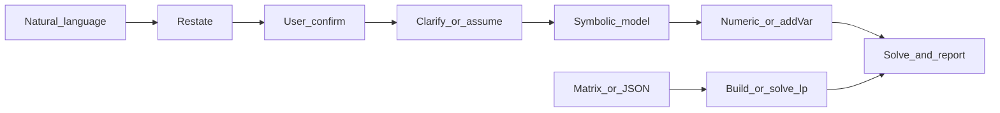

# 用 COPT 求解线性规划（Linear Program, LP）

## 适用场景

- 线性目标：`min` 或 `max` 的 `c^T x`
- 线性约束：`A_ub x <= b_ub`、`A_eq x == b_eq`（可只用其中一类或组合）
- 变量界：每个 `x_j` 可有下界、上界（或无界）

**输入**：可以是**自然语言/应用题**，也可以是**已给定的系数矩阵或 JSON**。不要默认要求用户先整理成矩阵；仅在用户已提供矩阵或完成符号化后，再用 JSON 字段复现或调用 `solve_lp`。

## Quick Start（先做这个）

按下面清单执行并在回答中保留结构：

- [ ] 路径判断：用户给的是自然语言，还是已给矩阵/JSON
- [ ] 输出重述（1-2 句）
- [ ] **请用户确认重述是否正确**（若有问题则澄清，无误则继续）
- [ ] 列变量/目标/约束（符号化）
- [ ] 需要时提关键澄清问题，或明确写出假设
- [ ] 给出求解结果（目标值 + 变量值）
- [ ] 用 1-2 句解释业务含义

## 执行流程（两条路径）



### 路径 A：已有矩阵或 JSON

1. 核对维度：`c` 长度、`A` 行列、`b` 长度与约束条数一致。
2. 用 [scripts/solve_lp.py](scripts/solve_lp.py) 中的 `solve_lp`，或按「手建模型」自行写 `coptpy`（适合需要命名变量、稀疏结构的题）。

### 路径 B：自然语言 / 应用题

用户未给数字矩阵时，Agent **不要**先索要 JSON。按下面交付物顺序推进：

| 步骤 | 内容 |
|------|------|
| 1. 重述 | 用一两句话复述题意，便于用户确认理解是否正确。 |
| 2. 用户确认 | **请用户确认**重述是否准确，如有偏差则澄清；无异议再继续。 |
| 3. 符号化 | **变量表**：名称、含义、单位（若有）、是否非负。**目标**：min 还是 max，线性式。**约束**：逐条写出，并标明 `<=` / `>=` / `=`（注意「不超过」「不少于」与不等号方向）。 |
| 4. 数值化 | 把符号模型写成 `c`、`A_ub`/`b_ub`、`A_eq`/`b_eq`、`bounds`；或跳过稠密矩阵，用 `addVar` + `addConstr` + 有意义约束名直接建模。 |
| 5. 求解与回答 | 给出最优值、各变量取值；必要时用一句话解释经济/物理含义（用户未问不必展开对偶或灵敏度）。 |

## 输出模板（推荐）

回答尽量按以下模板组织（可省略不适用小节）：

```markdown
### 问题重述
...

### 符号化模型
- 决策变量：...
- 目标函数：...
- 约束：...

### 数值化（可选）
- c: ...
- A_ub / b_ub: ...
- A_eq / b_eq: ...
- bounds: ...

### 求解结果
- status: ...
- objective: ...
- x: ...

### 结果解释
...
```

## 歧义与澄清

建模前若信息不足，**优先提问**；若是标准教材题型，可**列出假设再求解**，并在重述中写明假设：

- 目标是**最小化成本/资源**还是**最大化利润/效用**（口语可能含糊）。
- 「至多 / 不超过」→ 通常对应 `<=`；「至少 / 不少于」→ 通常对应 `>=`（按变量所在一侧核对）。
- 是否允许**分数解**（连续 LP 默认可行）；若题意明确要求**整数台数、0-1 选址**等，见下节，勿当连续变量悄悄求解。
- **非负**：产量、投入量等若题中未写，常默认 `>=0`，须在变量表里写明「假设非负」。
- **多商品、多期、多维约束**：检查下标与矩阵行、列是否一一对应，避免把行维与列维弄反。

## 范围与非 LP（本 skill 边界）

本文件针对**连续变量的 LP**。若叙述中出现下列情况，应向用户说明**已超出纯 LP**，需 MILP、非线性或其它建模，**禁止**不声明就把整数松弛成连续变量：

- **整数 / 0-1 决策**（台数、选或不选、开或关）。
- **二次项、两变量乘积、分段线性外的非线性**。
- **逻辑蕴含**（「若选 A 则必须…」）常需整数与 Big-M，不是纯 LP。

可建议用户另建 MILP skill 或使用 `coptpy` 的整数能力自行扩展；[scripts/solve_lp.py](scripts/solve_lp.py) **仅实现 LP**。

## 矩阵 / JSON 格式（可选，便于复现与脚本）

在已具备数值化结果或用户直接给出下列结构时使用：

- `sense`：`min` 或 `max`
- `c`：目标系数向量，形状 `(n,)`
- `A_ub` / `b_ub`（可选）：满足 **`A_ub @ x <= b_ub`**（行与 `b_ub` 同长）
- `A_eq` / `b_eq`（可选）：满足 **`A_eq @ x == b_eq`**
- `bounds`（可选）：长度 `n`，每项 `[lb, ub]`
  - `null` 表示该侧无界：例如 `[0, null]` 即 `x >= 0` 且无上界；`[null, 10]` 即 `x <= 10` 且无下界（在 Python/JSON 解析后常为 `None`；`solve_lp` 已兼容 `None` 与字符串 `"null"`）
  - 也可用具体数值如 `0`、`-1.2`
- `time_limit`（可选）：求解时间上限（秒）

更多样例在 `reference/` 目录（见 [reference/README.md](reference/README.md)）：**矩阵 JSON** 见 [reference/matrix-json-examples.md](reference/matrix-json-examples.md)；**自然语言 → 建模** 见 [reference/natural-language-examples.md](reference/natural-language-examples.md)。

## 环境与导入

```python
import coptpy as cp
from coptpy import COPT
```

无界一侧用 `lb=-COPT.INFINITY` 或 `ub=COPT.INFINITY`。

## 依赖与授权（不自动安装）

本 skill 不会自动下载 COPT；授权与安装通常需人工完成。

- **`ModuleNotFoundError: No module named 'coptpy'`**
  在当前环境执行：`pip install coptpy`（需要时 `pip install --upgrade coptpy`）。

- **License 未找到 / 授权失败**（日志中常见 `No license found` 等）
  安装或配置 COPT 许可证；常将 license 文件放在固定目录，并设置环境变量 **`COPT_LICENSE_DIR`** 指向该目录，然后重启 Python 或 IDE。

- **COPT 求解器本体未安装**
  从官方获取与系统匹配的安装包（如 Windows x64），安装后再安装 `coptpy` 或按厂商说明配置 Python 接口。

## 手建模型（与矩阵模板等价）

不写 `scripts/solve_lp.py`、直接写 `coptpy` 时的骨架如下（线性表达式用 `cp.quicksum` 较稳妥）：

```python
env = cp.Envr()
model = env.createModel("lp")
# x = [model.addVar(lb=..., ub=..., name="..."), ...]
# model.addConstr(cp.quicksum(...) <= 或 == ...)
# model.setObjective(cp.quicksum(...), sense=COPT.MINIMIZE 或 COPT.MAXIMIZE)
model.setParam(COPT.Param.TimeLimit, 10.0)  # 可选
model.solve()
# if model.status == COPT.OPTIMAL: obj = model.objval; 各变量 .x
```

## 状态、自检与向用户解释

**求解前自检**

- `len(c) == n`；`A_ub`、`A_eq` 的列数均为 `n`；`len(b_ub)`、`len(b_eq)` 分别等于不等式、等式行数。
- 若省略 `bounds`，`solve_lp` 对变量默认 **全实数**；应用题若隐含非负，必须显式给出 `bounds` 或改掉默认。

**求解后状态（对用户说明时可照搬含义）**

- `COPT.OPTIMAL`：存在有限最优解。
- `COPT.INFEASIBLE`：**可行域为空**——约束与界互相矛盾，或某条不等式方向写反；可请用户核对题意与符号化步骤。
- `COPT.UNBOUNDED`：沿改善目标的方向可行域无界——常见是少界、少约束，或把 `<=`/`>=` 建反导致可行方向错误。

## 脚本：`solve_lp`

完整实现见 [scripts/solve_lp.py](scripts/solve_lp.py)（`bounds` 兼容 `None` / `"null"`，与 JSON 解析一致）。

在项目或 REPL 中可将 skill 根目录下的 `scripts` 加入模块搜索路径后导入，或把该文件复制到工程内：

```python
import sys
from pathlib import Path

sys.path.insert(0, str(Path(__file__).resolve().parent / "scripts"))  # 按实际路径调整
from solve_lp import solve_lp

result = solve_lp(
    c=[3, 5],
    A_ub=[[1, 2], [2, 1]],
    b_ub=[100, 120],
    bounds=[(0, None), (0, None)],
    sense="max",
)
```

也可在配置好 COPT 后直接运行：`python scripts/solve_lp.py`（内置与 [reference/natural-language-examples.md](reference/natural-language-examples.md) 中「示例 0：两产品生产」一致的最小冒烟用例）。

端到端「自然语言 → 符号 → JSON」例题见 [reference/natural-language-examples.md](reference/natural-language-examples.md)（含示例 0 及运输、配方等）。

## 建模提示

- 无界（UNBOUNDED）常见原因：缺少必要的上/下界，或约束不足以挡住沿目标方向的射线。
- 构建左端线性式时优先使用 `cp.quicksum`，一般比手写长串 `+` 更清晰且更高效。
