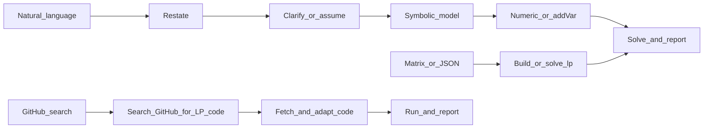

<!-- 作者：李爽夕 -->

# 线性规划（Linear Program, LP）求解

## 适用场景

- 线性目标：`min` 或 `max` 的 `c^T x`
- 线性约束：`A_ub x <= b_ub`、`A_eq x == b_eq`（可只用其中一类或组合）
- 变量界：每个 `x_j` 可有下界、上界（或无界）

**输入**：可以是**自然语言/应用题**，也可以是**已给定的系数矩阵或 JSON**。不要默认要求用户先整理成矩阵；仅在用户已提供矩阵或完成符号化后，再用 JSON 字段复现或调用 `solve_lp`。

## Quick Start（先做这个）

按下面清单执行并在回答中保留结构。**环境准备必须先于求解**。

- [ ] **环境准备与依赖安装（必须第一步）**：
  1. 参考 `../or-solver/SKILL.md` 执行统一求解器检测、安装与选择
  2. 确认问题类型为 LP，按降级策略选择求解器
  3. 若全部不可用且安装失败 → 走 GitHub 搜索路径
- [ ] 路径判断：用户给的是自然语言、已给矩阵/JSON，还是要求从 GitHub 找代码
- [ ] 求解器选择：优先使用可用求解器（COPT > Gurobi > MOSEK > CPLEX > HiGHS (scipy/highspy) > CLARABEL > OR-Tools/GLOP > PuLP/CBC > ECOS > CVXOPT > GLPK > SoPlex > lpsolve），无可用求解器时走 GitHub 搜索路径
- [ ] 输出重述（1-2 句）
- [ ] 列变量/目标/约束（符号化）
- [ ] 需要时提关键澄清问题，或明确写出假设
- [ ] 给出求解结果（目标值 + 变量值）
- [ ] 用 1-2 句解释业务含义

## 执行流程（三条路径）



### 路径 A：已有矩阵或 JSON

1. 核对维度：`c` 长度、`A` 行列、`b` 长度与约束条数一致。
2. 直接用 `coptpy`、`scipy.optimize.linprog` 或 `pulp` 建模求解。

### 路径 B：自然语言 / 应用题

用户未给数字矩阵时，Agent **不要**先索要 JSON。按下面交付物顺序推进：

| 步骤 | 内容 |
|------|------|
| 1. 重述 | 用一两句话复述题意，便于用户确认理解是否正确。 |
| 2. 符号化 | **变量表**：名称、含义、单位（若有）、是否非负。**目标**：min 还是 max，线性式。**约束**：逐条写出，并标明 `<=` / `>=` / `=`（注意「不超过」「不少于」与不等号方向）。 |
| 3. 数值化 | 把符号模型写成 `c`、`A_ub`/`b_ub`、`A_eq`/`b_eq`、`bounds`；或跳过稠密矩阵，用 `addVar` + `addConstr` + 有意义约束名直接建模。 |
| 4. 求解与回答 | 给出最优值、各变量取值；必要时用一句话解释经济/物理含义（用户未问不必展开对偶或灵敏度）。 |

### 路径 C：GitHub 搜索开源代码

当本地无可用的 LP 求解器（COPT 未安装/无 License，scipy 不可用等情况），**或用户明确要求从 GitHub 找代码**时，走此路径。

**Step 1：搜索**
用 WebSearch 搜索 GitHub，关键词格式：
```
site:github.com linear programming solver python <问题特征>
```
例如：`site:github.com linear programming simplex solver python`、`site:github.com transportation problem lp solver python`

**Step 2：筛选**
- 优先选择 Star 数高、近期更新、有 README 的仓库
- 优先选择纯 Python 实现（无需编译）的代码
- 确认代码支持当前问题类型（连续 LP / MILP 等）

**Step 3：获取代码**
用 WebFetch 抓取仓库的 README 和关键 Python 文件，理解其 API 和调用方式。

**Step 4：适配与运行**
- 将用户问题转化为该代码要求的输入格式
- 编写调用脚本，运行求解
- 若代码有 bug 或不适配，向用户说明并尝试修复

**Step 5：报告**
按下方输出模板给出结果，并注明代码来源（GitHub URL）。

## 输出模板（推荐）

回答尽量按以下模板组织（可省略不适用小节）：

```markdown
### 环境与依赖
- Python 版本：3.x.x
- 环境检测结果：
  - [已安装] numpy 2.x.x
  - [已安装] scipy 1.x.x (含 HiGHS 求解器)
  - [未安装] coptpy — 用户选择不安装
  - [未安装] pulp — pip install pulp (2.3s, 安装成功 ✓)
- 安装操作记录：
  - pip install pulp → 成功 (version 2.9.0)
- 可用求解器：HiGHS (scipy), PuLP/CBC
- 选用求解器：scipy.optimize.linprog (method='highs')

### 问题重述
...

### 符号化模型
- 决策变量：...
- 目标函数：...
- 约束：...

### 数值化（可选）
- c: ...
- A_ub / b_ub: ...
- A_eq / b_eq: ...
- bounds: ...

### 求解结果
- status: ...
- objective: ...
- x: ...

### 约束验证
- 约束1：... [OK]
- 约束2：... [OK]

### 结果解释
...
```

## 歧义与澄清

建模前若信息不足，**优先提问**；若是标准教材题型，可**列出假设再求解**，并在重述中写明假设：

- 目标是**最小化成本/资源**还是**最大化利润/效用**（口语可能含糊）。
- 「至多 / 不超过」→ 通常对应 `<=`；「至少 / 不少于」→ 通常对应 `>=`（按变量所在一侧核对）。
- 是否允许**分数解**（连续 LP 默认可行）；若题意明确要求**整数台数、0-1 选址**等，见下节，勿当连续变量悄悄求解。
- **非负**：产量、投入量等若题中未写，常默认 `>=0`，须在变量表里写明「假设非负」。
- **多商品、多期、多维约束**：检查下标与矩阵行、列是否一一对应，避免把行维与列维弄反。

## 范围与非 LP（本 skill 边界）

本文件针对**连续变量的 LP**。若叙述中出现下列情况，应向用户说明**已超出纯 LP**，需 MILP、非线性或其它建模，**禁止**不声明就把整数松弛成连续变量：

- **整数 / 0-1 决策**（台数、选或不选、开或关）。
- **二次项、两变量乘积、分段线性外的非线性**。
- **逻辑蕴含**（「若选 A 则必须…」）常需整数与 Big-M，不是纯 LP。

可建议用户另建 MILP skill 或使用 `coptpy` 的整数能力自行扩展。

## 矩阵 / JSON 格式（可选，便于复现与脚本）

在已具备数值化结果或用户直接给出下列结构时使用：

- `sense`：`min` 或 `max`
- `c`：目标系数向量，形状 `(n,)`
- `A_ub` / `b_ub`（可选）：满足 **`A_ub @ x <= b_ub`**（行与 `b_ub` 同长）
- `A_eq` / `b_eq`（可选）：满足 **`A_eq @ x == b_eq`**
- `bounds`（可选）：长度 `n`，每项 `[lb, ub]`
  - `null` 表示该侧无界：例如 `[0, null]` 即 `x >= 0` 且无上界；`[null, 10]` 即 `x <= 10` 且无下界（在 Python/JSON 解析后常为 `None`；`solve_lp` 已兼容 `None` 与字符串 `"null"`）
  - 也可用具体数值如 `0`、`-1.2`
- `time_limit`（可选）：求解时间上限（秒）

更多示例见 [examples.md](examples.md)，包含自然语言建模（生产、运输、配方、产销计划）和矩阵 JSON 格式示例。

## 求解器

求解器检测、安装、License 配置、降级策略等详见 `../or-solver/SKILL.md`。

LP 求解器优先级：**COPT > Gurobi > MOSEK > CPLEX > HiGHS (scipy/highspy) > CLARABEL > OR-Tools/GLOP > PuLP/CBC > ECOS > CVXOPT > GLPK > SoPlex > lpsolve > GitHub 搜索**。

开源首选 HiGHS（`scipy.optimize.linprog` / `highspy`，MIT），教学首选 `pulp`（CBC 后端）。商业首选 COPT。

### 常用求解器调用示例

```python
# HiGHS — scipy/highspy（开源首选）
from scipy.optimize import linprog
result = linprog(c, A_ub=A_ub, b_ub=b_ub, A_eq=A_eq, b_eq=b_eq,
                 bounds=bounds, method='highs')
print(result.message, result.fun, result.x)

# PuLP/CBC（教学首选）
from pulp import LpProblem, LpVariable, LpMinimize, lpSum, value
prob = LpProblem("lp", LpMinimize)
x = [LpVariable(f"x{i}", lowBound=0) for i in range(n)]
prob += lpSum(c[i] * x[i] for i in range(n))
prob.solve()
print(value(prob.objective), [v.value() for v in x])

# COPT（商业首选，需 License）
import coptpy as cp
from coptpy import COPT
env = cp.Envr()
model = env.createModel("lp")
x = [model.addVar(lb=0, ub=COPT.INFINITY, name=f"x{i}") for i in range(n)]
model.setObjective(cp.quicksum(c[i] * x[i] for i in range(n)), COPT.MINIMIZE)
model.solve()
```

## 手建模型（与矩阵模板等价）

直接写 `coptpy` 时的骨架如下（线性表达式用 `cp.quicksum` 较稳妥）：

```python
env = cp.Envr()
model = env.createModel("lp")
# x = [model.addVar(lb=..., ub=..., name="..."), ...]
# model.addConstr(cp.quicksum(...) <= 或 == ...)
# model.setObjective(cp.quicksum(...), sense=COPT.MINIMIZE 或 COPT.MAXIMIZE)
model.setParam(COPT.Param.TimeLimit, 10.0)  # 可选
model.solve()
# if model.status == COPT.OPTIMAL: obj = model.objval; 各变量 .x
```

## 状态、自检与向用户解释

**求解前自检**

- `len(c) == n`；`A_ub`、`A_eq` 的列数均为 `n`；`len(b_ub)`、`len(b_eq)` 分别等于不等式、等式行数。
- 若省略 `bounds`，`solve_lp` 对变量默认 **全实数**；应用题若隐含非负，必须显式给出 `bounds` 或改掉默认。

**求解后状态（对用户说明时可照搬含义）**

- `COPT.OPTIMAL`：存在有限最优解。
- `COPT.INFEASIBLE`：**可行域为空**——约束与界互相矛盾，或某条不等式方向写反；可请用户核对题意与符号化步骤。
- `COPT.UNBOUNDED`：沿改善目标的方向可行域无界——常见是少界、少约束，或把 `<=`/`>=` 建反导致可行方向错误。

## 建模示例

详见 [examples.md](examples.md)，包含自然语言建模示例（生产、运输、配方、产销计划）和矩阵 JSON 格式调用示例。

## 建模提示

- 无界（UNBOUNDED）常见原因：缺少必要的上/下界，或约束不足以挡住沿目标方向的射线。
- 构建左端线性式时优先使用 `cp.quicksum`，一般比手写长串 `+` 更清晰且更高效。
- 对于通过 cvxpy 建 LP，可用 `cvx.Minimize(c @ x)` + `constraints` + `prob.solve(solver=...)` 统一切换后端。
- OR-Tools 的 GLOP 不能处理 MILP；需要整数时换用 SCIP 或 CBC 后端。
