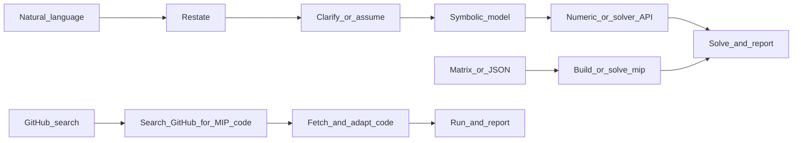

<!-- 作者：李爽夕 -->

# 混合整数规划（Mixed-Integer Programming, MIP）求解

## 适用场景

- **混合整数线性规划**：线性目标、线性约束，部分或全部变量为整数。
- **二进制决策问题**：选址、指派、覆盖、启停、固定费用建模。
- **组合优化建模**：背包、TSP、排产、车辆路径、网络设计等。
- **可线性化问题**：逻辑约束、Big-M、indicator、SOS1/SOS2 等。

**输入**：可以是自然语言/应用题，也可以是矩阵、JSON、已有模型代码或求解器报错。

## Quick Start（先做这个）

按下面清单执行并在回答中保留结构。环境准备必须先于求解。

- [ ] **环境准备与依赖安装**：
  1. 参考 `../or-solver/SKILL.md` 执行统一求解器检测、安装与选择。
  2. 确认问题类型为 MIP/MILP，按降级策略选择求解器。
  3. 若没有可用求解器且安装失败，再走 GitHub 搜索路径。
- [ ] 路径判断：用户给的是自然语言、矩阵/JSON、代码，还是要求从 GitHub 找代码。
- [ ] 符号化：列变量、变量类型、目标、约束和单位。
- [ ] 数值化：给出矩阵、JSON，或直接用求解器 API 建模。
- [ ] 求解并报告：状态、目标值、变量值、MIP gap、求解时间。
- [ ] 验证：检查约束可行性和整数变量取值。

## 执行流程（三条路径）



### 路径 A：已有矩阵、JSON 或模型

1. 核对维度、变量类型、上下界、约束方向和目标方向。
2. 优先复用已有建模结构，避免把稀疏模型强行转成稠密矩阵。
3. 使用可用求解器求解，并保存求解器状态和日志要点。

### 路径 B：自然语言 / 应用题

用户未给数字矩阵时，不要先索要 JSON。按下面顺序推进：

| 步骤 | 内容 |
| --- | --- |
| 1. 重述 | 用一两句话复述题意，便于用户确认。 |
| 2. 变量 | 列出变量名称、含义、单位、类型（binary/integer/continuous）。 |
| 3. 模型 | 写出目标函数和约束，并标明 `<=` / `>=` / `=`。 |
| 4. 求解 | 建模求解，报告目标值、变量值、gap 和状态。 |
| 5. 解释 | 用 1-2 句解释业务含义，必要时说明假设。 |

### 路径 C：GitHub 搜索开源代码

当本地无可用求解器，或用户明确要求从 GitHub 找代码时，搜索：

```text
site:github.com mixed integer programming solver python <problem feature>
```

优先选择近期维护、有 README、纯 Python 或主流求解器接口的项目。抓取
README 和关键文件后，适配用户数据并注明来源。

## 输出模板（推荐）

```markdown
### 环境与依赖
- Python 版本：...
- 可用求解器：...
- 选用求解器：...

### 问题重述
...

### 符号化模型
- 决策变量：...
- 目标函数：...
- 约束：...

### 求解结果
- status: ...
- objective: ...
- variables: ...
- mip_gap: ...

### 验证与解释
...
```
