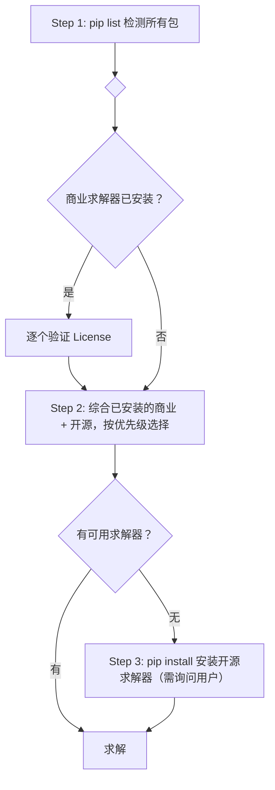

<!-- 作者：李爽夕 -->

# 运筹优化求解器统一配置

## 适用场景

本 skill 为以下运筹优化 skill 提供统一的求解器检测、安装与选择：

- **LP**（线性规划）→ `../linear-programming/SKILL.md`
- **MIP**（混合整数规划）→ `../mixed-integer-programming/SKILL.md`
- **SOCP**（二阶锥规划）→ `../second-order-cone-programming/SKILL.md`

当 LP / MIP / SOCP skill 在 Quick Start 第一步需要做环境准备时，应调用本 skill 的检测与安装流程，而非各自维护独立的求解器管理代码。

## Quick Start（求解器环境准备）

核心原则：**先检测，再分类，后规划**。不做任何预设。



### Step 1：统一检测

执行以下命令，一次性检测所有求解器包：

```bash
pip list | findstr -i "coptpy gurobipy mosek cplex pyscipopt highspy clarabel pulp mip ortools ecos scs cvxopt cosmo osqp swiglpk scipy lpsolve55 numpy cvxpy"
```

Unix 下将 `findstr -i` 替换为 `grep -iE`。

检测后，将结果分为两类：

| 类别 | 包含包 |
|------|--------|
| 商业求解器（需 License） | `coptpy`, `gurobipy`, `mosek`, `cplex` |
| 开源求解器（无需 License） | `scipy`, `highspy`, `pulp`, `cvxpy`, `clarabel`, `ecos`, `scs`, `cvxopt`, `cosmo`, `osqp`, `pyscipopt`, `mip`, `ortools`, `swiglpk`, `lpsolve55` |
| 基础依赖 | `numpy` |

### Step 2：分类验证 + 选择

#### 2a. 验证商业求解器 License（仅对已安装的）

检测到哪些商业求解器，就逐一验证哪些。**不做"大概率没有"的预设**——用户设备上有什么就验证什么。

对每个已安装的商业求解器，通过**实际创建模型**来验证 License（不能只看包是否可导入）：

| 求解器 | License 验证方式 |
|--------|-----------------|
| COPT | `import coptpy as cp; cp.Envr().createModel("_t")` — 抛异常则 License 缺失 |
| Gurobi | `import gurobipy as gp; gp.Model("_t")` — 抛异常则 License 缺失（注意：v13+ 自带受限 License，通常无需额外配置） |
| MOSEK | 通过 cvxpy 调用 `prob.solve(solver=cvx.MOSEK)` — 裸 `mosek.Env()` 可能走试用许可，但 **cvxpy 调用必须要有正式 `mosek.lic` 文件** |
| CPLEX | 通过 cvxpy 调用 `prob.solve(solver=cvx.CPLEX)` — v22.1+ 自带学术 License |

验证结果：
- **License 有效** → 该求解器标记为可用
- **License 缺失** → 告知用户如何申请（详见「License 配置」节），将该求解器标记为不可用，继续检查其他求解器

#### 2b. 确认问题类型

确认用户当前要解的是 LP / MIP / SOCP 中哪一类。

#### 2c. 按优先级选择求解器

综合 Step 1 和 2a 的结果，按以下优先级表选择第一个可用的求解器。

**LP 优先级**：
```
COPT > Gurobi > MOSEK > CPLEX > scipy/HiGHS > highspy > clarabel > pulp/CBC > ecos > cvxopt > glpk > lpsolve
```

**MIP 优先级**：
```
COPT > Gurobi > CPLEX > MOSEK > pyscipopt/SCIP > highspy > pulp/CBC > python-mip > OR-Tools/SCIP > OR-Tools/CP-SAT > glpk > lpsolve
```

**SOCP 优先级**：
```
COPT > Gurobi > MOSEK > CPLEX > clarabel > ecos > scs > cvxopt > cosmo > osqp
```

说明：
- 优先级列表中，商业求解器排前面是因为**如果用户已安装且 License 有效**，其性能远超开源
- License 无效的商业求解器不参与排序
- 未安装的求解器不参与排序

### Step 3：安装缺失求解器（当列表全部不可用时）

若优先级列表中**没有任何可用求解器**，引导用户安装开源求解器（`pip install` 即用，无需 License）：

```bash
pip install numpy scipy                          # 只做 LP（scipy 自带 HiGHS）
pip install numpy pulp                            # LP + MIP（PuLP 自带 CBC）
pip install numpy scipy pulp cvxpy clarabel       # LP + MIP + SOCP（全套开源）
```

**安装前必须询问用户。** 安装完成后回到 Step 2c 重新选择。

仅在以下情况考虑安装商业求解器：
- 用户**明确要求**（如"我想用 Gurobi"）
- 用户**已有 License** 并询问如何安装配置

### Step 4：输出求解器报告

汇总检测与选择结果：

```markdown
### 环境与依赖
- Python 版本：3.x.x
- 检测结果：
  - 商业求解器：COPT (✓ License OK) / Gurobi (✓) / MOSEK (✗ 缺 License) / CPLEX (✓) / 未检测到任何商业求解器
  - 开源求解器：[已安装] scipy x.x.x, pulp x.x.x, cvxpy x.x.x, clarabel x.x.x, ... / [未安装] ...
- 问题类型：LP / MIP / SOCP
- 选用求解器：xxx（原因：在可用求解器中优先级最高 / License 有效 / 开源零配置）
```

---

## 求解器-问题类型矩阵

| 求解器 | 包名 | LP | MIP | SOCP | 授权 | 安装命令 |
|--------|------|:--:|:--:|:----:|------|----------|
| **COPT** | `coptpy` | ✅ | ✅ | ✅ | 商业（学术免费） | `pip install coptpy` |
| **Gurobi** | `gurobipy` | ✅ | ✅ | ✅ v11+ | 商业（学术免费） | `pip install gurobipy` |
| **MOSEK** | `mosek` | ✅ | ✅ | ✅ | 商业（学术免费） | `pip install mosek` |
| **CPLEX** | `cplex` | ✅ | ✅ | ✅ v20+ | 商业（学术免费） | `pip install cplex` |
| **SCIP** | `pyscipopt` | △ | ✅ | ❌ | Apache 2.0 | `pip install pyscipopt` |
| **HiGHS** | `highspy` | ✅ | ✅ | ❌ | MIT | `pip install highspy` |
| **CLARABEL** | `clarabel` | ✅ | ❌ | ✅ | Apache 2.0 | `pip install clarabel` |
| **CBC** (PuLP) | `pulp` | ✅ | ✅ | ❌ | EPL | `pip install pulp` |
| **CBC** (python-mip) | `mip` | △ | ✅ | ❌ | EPL | `pip install mip` |
| **OR-Tools** | `ortools` | ✅ | ✅ | ❌ | Apache 2.0 | `pip install ortools` |
| **ECOS** | `ecos` | ✅ | ❌ | ✅ | GPLv3 | `pip install ecos` |
| **SCS** | `scs` | △ | ❌ | ✅ | MIT | `pip install scs` |
| **CVXOPT** | `cvxopt` | ✅ | ❌ | ✅ | GPLv3 | `pip install cvxopt` |
| **COSMO** | `cosmo` | △ | ❌ | ✅ | Apache 2.0 | `pip install cosmo` |
| **OSQP** | `osqp` | ✅ | ❌ | △ QP only | Apache 2.0 | `pip install osqp` |
| **GLPK** | `swiglpk` | ✅ | ✅ | ❌ | GPLv3 | `pip install swiglpk` |
| **scipy/HiGHS** | `scipy` | ✅ | ❌ | ❌ | MIT | `pip install scipy` |
| **SoPlex** | `pyscipopt` | ✅ | ❌ | ❌ | Apache 2.0 | 随 SCIP 安装 |
| **lpsolve** | `lpsolve55` | ✅ | ✅ | ❌ | LGPL | `pip install lpsolve55` |
| **cvxpy** | `cvxpy` | △ | △ | ✅ | Apache 2.0 | `pip install cvxpy` |

**图例**：✅ 完全支持 · △ 部分支持/有限支持 · ❌ 不支持

**说明**：
- `cvxpy` 不是求解器本身，而是 SOCP/LP 的统一建模接口（可用它调用 CLARABEL/ECOS/SCS 等后端）。SOCP 必装 cvxpy。
- `scipy` >= 1.6.0 内置 HiGHS，但 `scipy.optimize.linprog` **不支持整数变量**。MIP 必须用 `highspy` 原生接口。
- `SoPlex` 随 `pyscipopt` 自动安装，是 SCIP 的默认 LP 求解器。
- OR-Tools 包含三个后端：GLOP（纯 LP）、SCIP（LP+MIP）、CP-SAT（组合优化，非标准 MIP）。
- △ 标注说明：
  - SCIP LP △：可用（内嵌 SoPlex），但不推荐专门为 LP 安装 SCIP。
  - python-mip LP △：底层 CBC 支持 LP，但接口面向 MIP 设计，纯 LP 建议用 PuLP 或 scipy。
  - COSMO LP △：ADMM 锥求解器可解 LP（LP ⊂ SOCP），但效率和精度不如 LP 专用求解器。
  - SCS LP △：一阶 ADMM 方法，仅能给出近似解，不推荐用于纯 LP。

---

## 安装指南

### 一键安装（按问题类型）

```bash
# 只做 LP（最小安装，零额外依赖）
pip install numpy scipy

# LP + MIP（覆盖最常用场景）
pip install numpy pulp

# LP + MIP + SOCP（全套开源，覆盖所有 skill）
pip install numpy scipy pulp cvxpy clarabel
```

```bash
# 商业求解器（需分别获取 License，详见「License 配置」节）
pip install coptpy gurobipy mosek cplex
```

### 单个求解器安装

```bash
# --- 商业求解器（需 License）---
pip install coptpy          # COPT — 国产高性能 ★ 商业首选
pip install gurobipy        # Gurobi — 业界标杆
pip install mosek           # MOSEK — 锥优化标杆
pip install cplex           # IBM CPLEX

# --- 开源推荐 ---
pip install highspy         # HiGHS (MIT) — LP/MILP 开源首选
pip install pyscipopt       # SCIP (Apache 2.0) — MIP 开源最强
pip install clarabel        # CLARABEL (Apache 2.0) — SOCP 开源首选
pip install pulp            # PuLP + CBC (EPL) — 教学首选
pip install mip             # python-mip (EPL) — CBC 现代接口
pip install ortools         # OR-Tools (Apache 2.0) — Google 出品

# --- 开源备选 ---
pip install ecos            # ECOS (GPLv3) — 嵌入式锥优化
pip install scs             # SCS (MIT) — 大规模锥优化 ADMM
pip install cvxopt          # CVXOPT (GPLv3) — 经典内点法
pip install cosmo           # COSMO (Apache 2.0) — ADMM 锥优化
pip install osqp            # OSQP (Apache 2.0) — QP 专用

# --- 系统级 / 第三方 ---
pip install swiglpk         # GLPK (GPLv3) — 需系统安装 libglpk
pip install lpsolve55       # lpsolve (LGPL) — 需系统安装 lp_solve
```

### 安装后验证

```python
# 开源求解器（最小集）
import numpy; print(f"numpy={numpy.__version__}")
import scipy; print(f"scipy={scipy.__version__}")
from scipy.optimize import linprog; print("scipy/HiGHS OK")

# cvxpy + 可用后端
import cvxpy; print(f"cvxpy={cvxpy.__version__}, solvers={cvxpy.installed_solvers()}")

# 商业求解器（仅当已安装时验证）
# COPT   — import coptpy as cp; cp.Envr().createModel("_t"); print("COPT OK")
# Gurobi — import gurobipy as gp; gp.Model("_t"); print(f"Gurobi {gp.__version__} OK")
# MOSEK  — import cvxpy as cvx; x=cvx.Variable(1); cvx.Problem(cvx.Minimize(x),[x>=1]).solve(solver=cvx.MOSEK); print("MOSEK OK")
# CPLEX  — import cvxpy as cvx; x=cvx.Variable(1); cvx.Problem(cvx.Minimize(x),[x>=1]).solve(solver=cvx.CPLEX); print("CPLEX OK")
```

---

## License 配置

### COPT

```bash
# 从 https://www.shanshu.ai/copt 申请学术 License
# 设置环境变量指向 License 目录
export COPT_LICENSE_DIR=/path/to/copt/license
# Windows: set COPT_LICENSE_DIR=C:\path\to\copt\license
```

验证：
```python
import coptpy as cp
env = cp.Envr()
# License 有效则 createModel 成功，否则抛异常
model = env.createModel("_license_check")
print("COPT license OK")
```

### Gurobi

```bash
# Gurobi 13+ 自带受限 License（非生产用途），无需额外配置
# 若需完整学术 License：从 https://www.gurobi.com/downloads/ 注册
# 安装后运行 grbgetkey 激活
grbgetkey <your-license-key>
```

验证：
```python
import gurobipy as gp
# Gurobi 13+ 可直接创建模型，license 无效时抛异常
m = gp.Model("_license_check")
print(f"Gurobi {gp.__version__} license OK")
```

### MOSEK

```bash
# 注意：MOSEK 裸 `mosek.Env()` 可能自动激活试用许可，
# 但 cvxpy 调用 MOSEK 必须有正式 mosek.lic 文件！实际使用需申请正式 License。

# 从 https://www.mosek.com/products/academic-licenses/ 申请
# 将 mosek.lic 放入 ~/mosek/ 目录
mkdir -p ~/mosek
cp mosek.lic ~/mosek/
```

验证（必须通过 cvxpy 测试，因为这是实际调用路径）：
```python
import cvxpy as cvx
x = cvx.Variable(1)
try:
    cvx.Problem(cvx.Minimize(x), [x >= 1]).solve(solver=cvx.MOSEK)
    print("MOSEK license OK (via cvxpy)")
except Exception as e:
    if 'license' in str(e).lower():
        print("MOSEK license 缺失！请从 https://www.mosek.com/products/academic-licenses/ 申请")
        print("并将 mosek.lic 放入 ~/mosek/ 目录")
    else:
        raise
```

### CPLEX

```bash
# CPLEX 22.1+ 自带学术 License（pip install 即用）
# 若需完整商业 License：从 https://www.ibm.com/academic/ 注册 IBM Academic Initiative
pip install cplex
# 或使用 docplex 高层接口
pip install docplex
```

验证：
```python
import cvxpy as cvx
# 通过 cvxpy 调用 CPLEX，license 无效时抛异常
x = cvx.Variable(1)
cvx.Problem(cvx.Minimize(x), [x >= 1]).solve(solver=cvx.CPLEX)
print("CPLEX license OK")
```

---

## 常见错误与排查

### 安装错误

| 错误信息 | 原因 | 解决 |
|----------|------|------|
| `ModuleNotFoundError: No module named 'coptpy'` | COPT 未安装 | `pip install coptpy`（需 License） |
| `ModuleNotFoundError: No module named 'gurobipy'` | Gurobi 未安装 | `pip install gurobipy`（需 License） |
| `ModuleNotFoundError: No module named 'pulp'` | PuLP 未安装 | `pip install pulp` |
| `ModuleNotFoundError: No module named 'highspy'` | HiGHS 未安装 | `pip install highspy` |
| `ModuleNotFoundError: No module named 'cvxpy'` | cvxpy 未安装 | `pip install cvxpy` |
| `ModuleNotFoundError: No module named 'pyscipopt'` | SCIP 未安装 | `pip install pyscipopt` |
| `ModuleNotFoundError: No module named 'mip'` | python-mip 未安装 | `pip install mip` |
| `ModuleNotFoundError: No module named 'ortools'` | OR-Tools 未安装 | `pip install ortools` |
| `ModuleNotFoundError: No module named 'ecos'` | ECOS 未安装 | `pip install ecos` |
| `ModuleNotFoundError: No module named 'clarabel'` | CLARABEL 未安装 | `pip install clarabel` |

### License 错误

| 错误信息 | 原因 | 解决 |
|----------|------|------|
| COPT: `License not found` | License 文件未找到 | 设置 `COPT_LICENSE_DIR` 环境变量 |
| Gurobi: `No Gurobi license found` | 未激活或过期 | 运行 `grbgetkey` 重新激活 |
| MOSEK: `err_missing_license_file(1008)` | `mosek.lic` 不在 `~/mosek/` | 检查文件路径或重新申请 |
| CPLEX: `No CPLEX license found` | 未安装或过期 | 检查 IBM Academic Initiative 状态 |

### 运行时错误

| 问题 | 原因 | 解决 |
|------|------|------|
| `linprog` 不支持整数变量 | scipy 的 HiGHS 仅限 LP | MIP 用 `highspy` 原生接口或 pulp/CBC |
| SOCP 求解器不可用 | cvxpy 后端未安装 | `pip install clarabel ecos scs` |
| MIP 求解太慢 | 默认 gap 太小 / 无时间限制 | 设 `TimeLimit` + 放宽 `RelGap` |
| 数值不稳定 / 解不精确 | Big-M 太大 / 数据未缩放 | 紧化 Big-M，标准化数据 |
| cvxpy 找不到求解器 | 求解器包未安装或版本不兼容 | `python -c "import cvxpy; print(cvxpy.installed_solvers())"` |

---

## 集成方式（供 LP/MIP/SOCP skill 引用）

LP / MIP / SOCP skill 在 Quick Start 的环境准备步骤中，可简化为对本 skill 的调用：

```markdown
- [ ] **环境准备与依赖安装（必须第一步）**：
  1. 参考 `../or-solver/SKILL.md` 执行统一求解器检测与安装
  2. 确认当前问题类型为 [LP / MIP / SOCP]
  3. 按降级策略选择求解器，若无可用求解器则安装
  4. 验证导入成功
```

然后直接进入各自 skill 的路径判断与问题建模。

---

## 与 GitHub 搜索的衔接

当以下情况发生时，不应继续尝试安装本地求解器，应直接进入各自 skill 的「路径 C：GitHub 搜索」：

- 所有求解器安装均失败（网络/权限/系统不兼容）
- Python 环境受限（无法 pip install）
- 用户明确要求使用 GitHub 开源独立实现

GitHub 搜索关键词因问题类型而异，详见各自 skill：
- LP：`site:github.com linear programming solver python`
- MIP：`site:github.com mixed integer programming solver python`
- SOCP：`site:github.com second order cone programming solver python`
