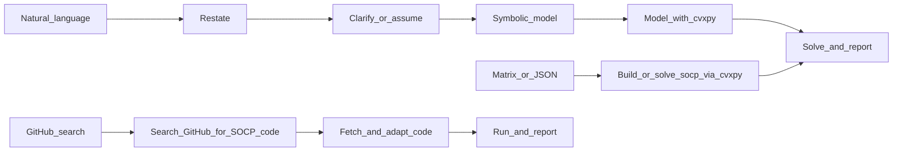

<!--
  作者：李爽夕
  Benchmark 数据来源：CBLIB 2014 (Conic Benchmark Library)
  https://cblib.zib.de/
  引用文献：Friberg, H.A. (2016). "CBLIB 2014: a benchmark library for conic
    mixed-integer and continuous optimization." Mathematical Programming
    Computation, 8(2), 191-214. DOI: 10.1007/s12532-015-0092-4
  许可证：Copyright (c) 2012, Zuse Institute Berlin and Technical University
    of Denmark. 可自由使用，须保留版权声明，不得虚假声称原创。
-->

# 二阶锥规划（Second-Order Cone Program, SOCP）求解

## 适用场景

- **标准 SOCP**：线性目标 + 二阶锥约束 `||A_i x + b_i||_2 <= d_i^T x + e_i`
- **可转化为 SOCP 的问题**：二次约束（通过 Cholesky 分解）、分式目标（通过 Charnes-Cooper 变换）、概率约束（正态分布假设下）、Group Lasso 等
- **投资组合优化**：最小化风险、最大化夏普比率、鲁棒组合等
- **鲁棒优化**：椭球不确定集下的线性规划鲁棒对等
- **工程优化**：天线阵列校准、塑性极限分析、FIR 滤波器设计等

**输入**：可以是**自然语言/应用题**，也可以是**已给的系数矩阵或 JSON**。

## Quick Start（先做这个）

按下面清单执行并在回答中保留结构。**环境准备必须先于求解**。

- [ ] **环境准备与依赖安装（必须第一步）**：
  1. 参考 `../or-solver/SKILL.md` 执行统一求解器检测、安装与选择
  2. 确认问题类型为 SOCP，按降级策略选择求解器
  3. 若全部不可用且安装失败 → 走 GitHub 搜索路径
- [ ] 路径判断：用户给的是自然语言描述、矩阵/JSON，还是要求从 GitHub 找代码
- [ ] 求解器选择：优先使用可用求解器（COPT > Gurobi > MOSEK > CPLEX > CLARABEL > ECOS > SCS > CVXOPT > COSMO > OSQP），无可用求解器时走 GitHub 搜索路径
- [ ] 问题类型：是标准的 SOCP（锥约束），还是可转化为 SOCP 的问题
- [ ] 输出重述（1-2 句）
- [ ] 列变量/目标/约束（符号化）
- [ ] 需要时提关键澄清问题，或明确写出假设
- [ ] 给出求解结果（目标值 + 变量值）
- [ ] 用 1-2 句解释业务含义

## 执行流程（三条路径）



### 路径 A：已有矩阵或 JSON

1. 核对维度：目标系数、约束矩阵、锥约束参数一致。
2. 直接用 `cvxpy` 建模求解。

### 路径 B：自然语言 / 应用题

用户未给数字矩阵时，Agent **不要**先索要 JSON。按下面交付物顺序推进：

| 步骤 | 内容 |
|------|------|
| 1. 重述 | 用一两句话复述题意，便于用户确认理解是否正确。 |
| 2. 符号化 | **变量表**：名称、含义、单位（若有）、是否非负。**目标**：min 还是 max，线性式。**约束**：逐条写出，标明是线性约束还是锥约束。 |
| 3. 数值化 | 把符号模型写成 `c`、锥约束参数等；或用 `cvxpy.Variable` + `cvxpy.SOC` 直接建模。 |
| 4. 求解与回答 | 给出最优值、各变量取值；必要时用一句话解释经济/物理含义。 |

### 路径 C：GitHub 搜索开源代码

当本地无可用的 SOCP 求解器（cvxpy 未安装，COPT/ECOS/SCS 均不可用），**或用户明确要求从 GitHub 找代码**时，走此路径。

**Step 1：搜索**
用 WebSearch 搜索 GitHub，关键词格式：
```
site:github.com second order cone programming solver python <问题特征>
```
例如：`site:github.com SOCP solver python cvxpy`、`site:github.com robust optimization second order cone python`

**Step 2：筛选**
- 优先选择 Star 数高、近期更新、有 README 的仓库
- 优先选择基于 cvxpy 或 numpy/scipy 的纯 Python 实现
- 确认代码支持 SOCP（不仅是 LP 或 QP）

**Step 3：获取代码**
用 WebFetch 抓取仓库的 README 和关键 Python 文件，理解其 API 和调用方式。

**Step 4：适配与运行**
- 将用户问题转化为该代码要求的输入格式
- 编写调用脚本，运行求解
- 若代码有 bug 或不适配，向用户说明并尝试修复

**Step 5：报告**
按下方输出模板给出结果，并注明代码来源（GitHub URL）。

## 输出模板（推荐）

回答尽量按以下模板组织（可省略不适用小节）：

```markdown
### 环境与依赖
- Python 版本：3.x.x
- 环境检测结果：
  - [已安装] numpy 2.x.x
  - [已安装] cvxpy 1.x.x
  - [已安装] scs 3.x.x (开源 MIT)
  - [未安装] coptpy — 商业软件，需单独安装和 License
  - [未安装] ecos — pip install ecos (1.5s, 安装成功 ✓)
- 安装操作记录：
  - pip install ecos → 成功 (version 2.0.14)
- cvxpy 可用求解器列表：['SCS', 'ECOS', 'OSQP']
- 选用求解器：SCS (COPT 不可用时的降级选择)

### 问题重述
...

### 符号化模型
- 决策变量：...
- 目标函数：...
- 线性约束：...
- 锥约束：...

### 数值化（可选）
- c: ...
- 锥约束参数: ...

### 求解结果
- status: ...
- objective: ...
- x: ...

### 约束验证
- 线性约束：最大违反 x.xx [OK]
- 锥约束：||A_i x + b_i|| <= d_i^T x + e_i [OK]

### 结果解释
...
```

## 歧义与澄清

- **最小化风险**：确认风险度量是方差还是标准差？默认标准差（锥约束形式）。
- **不确定集合**：确认形式（椭球、盒式、多面体）？默认椭球。
- **是否允许卖空**：投资组合问题中需确认，默认不允许卖空（`w >= 0`）。
- **风险厌恶系数**：若用户未指定，可设默认值 1.0 并注明假设。

## 范围与非 SOCP（本 skill 边界）

本文件针对**凸二阶锥规划**。若叙述中出现下列情况，应向用户说明**已超出纯 SOCP**：

- **整数 / 0-1 决策**（混合整数二阶锥规划 MISOCP）。
- **非凸二次约束**（如双曲旋转未转为锥形）。
- **半定规划（SDP）**（矩阵变量与线性矩阵不等式）。

可建议用户使用 `coptpy` 的整数能力或 MILP skill 处理整数部分。

## 求解器

求解器检测、安装、License 配置、降级策略等详见 `../or-solver/SKILL.md`。

SOCP 求解器优先级：**COPT > Gurobi > MOSEK > CPLEX > CLARABEL > ECOS > SCS > CVXOPT > COSMO > OSQP > GitHub 搜索**。

cvxpy 作为统一建模接口，可无缝切换后端求解器。开源首选 `CLARABEL`（Apache 2.0，同质嵌入内点法，2024），备选 `ECOS`（GPLv3）。商业首选 COPT。

### 常用求解器调用示例

```python
import numpy as np
import cvxpy as cvx

x = cvx.Variable(n)
objective = cvx.Minimize(c @ x)
constraints = [
    A_ub @ x <= b_ub,
    cvx.SOC(t, F @ x + g),   # ||F@x+g||_2 <= t
]

# CLARABEL（开源首选）
prob = cvx.Problem(objective, constraints)
prob.solve(solver=cvx.CLARABEL)

# COPT（商业首选，需 License）
prob.solve(solver=cvx.COPT)

# ECOS（开源备选）
prob.solve(solver=cvx.ECOS)

print(prob.status, prob.value, x.value)
```

## 手建模型（cvxpy 骨架）

直接用 `cvxpy` 建模时的骨架如下：

```python
import numpy as np
import cvxpy as cvx

x = cvx.Variable(n)
objective = cvx.Minimize(c.T @ x)

# 线性约束 + 二阶锥约束
constraints = [
    A_ub @ x <= b_ub,                    # 线性不等式
    A_eq @ x == b_eq,                    # 线性等式
    cvx.SOC(t, F @ x + g),               # 锥约束: ||F@x+g||_2 <= t
]

prob = cvx.Problem(objective, constraints)
prob.solve(solver=cvx.COPT)  # 或 cvx.ECOS, cvx.SCS, cvx.MOSEK

print(prob.status, prob.value, x.value)
```

## 求解状态（对用户说明）

- `optimal`：存在有限最优解。
- `infeasible`：可行域为空——约束矛盾。
- `unbounded`：目标无界——缺少必要约束。
- `optimal_inaccurate`：解精度不足——可尝试减小容差或换求解器。

## 建模示例

详见 [examples.md](examples.md)，包含 10 个完整示例（基本 SOCP、投资组合优化、夏普比率、鲁棒优化、多锥约束、概率约束、Group Lasso、最差情况风险、天线阵列校准 CBLIB nb_L2、塑性极限分析 CBLIB qssp30）。

## 建模提示

- 二阶锥约束的标准形式：`||A x + b||_2 <= d^T x + e`
- 使用 `cvxpy.SOC(t, x)` 其中 `t` 是标量变量，要求 `||x||_2 <= t`
- 投资组合风险项 `sqrt(w^T Sigma w)` 可通过 Cholesky 分解 `L L^T = Sigma` 转为 `||L^T w||_2` 放入锥约束
